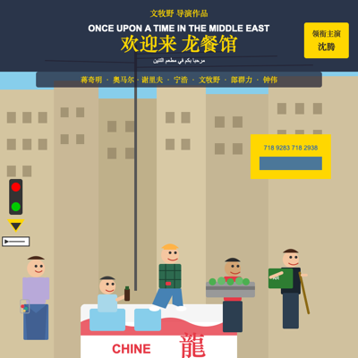

# ds-vision 🖼️ — DeepSeek 视觉多模态模型能力验证

> **Validate `deepseek-v4-flash-vision-exp` with real images — understanding, creation, and a text-driven SVG recreation loop.**
> 用本地图片实测 DeepSeek 首个视觉多模态模型：理解、创作，以及「图像 → 文本 → 视觉重构」的跨模态闭环验证。


## ✨ Features

- **逐图理解**：高保真画面描述、中英阿混排 OCR、多图剧情连贯性分析
- **文本驱动还原（核心）**：图像 → 理解文本 → **仅凭文本**再次调用视觉模型 → SVG → PNG，验证理解到视觉重构的完整闭环
- **双传图路径**：base64 内联 与 Files API（上传 → `file_id` 引用）双路径对照
- **单文件三列对比报告**：原图 | 模型理解 | 还原图，三张图汇总一个 Markdown 文件
- **生成能力探测**：四连问实证模型输出边界（无图片文件生成，有 SVG/ASCII 代码媒介创作）
- **工程化**：TDD 34 测试全绿、clippy 零警告、API Key 零泄漏、报告可提交

## 🖥️ 效果预览

每张测试图（电影《欢迎来龙餐馆》海报）产出「原图 ↔ 还原图」对照：

| 01.jpg（2000×2800） | 02.webp（2000×2800） | 03.jpg（800×1142） |
| :---: | :---: | :---: |
|  |  |  |
|  |  |  |

> 上排为原图缩略图，下排为模型**仅凭理解文本**（无原图输入）重构的 SVG 渲染图。
> 完整三列对比（含理解全文、耗时与 token 统计）见 `reports/<最新>/report.md`。

## 📖 背景

DeepSeek 于 2026-08-21 发布首个视觉多模态模型 `deepseek-v4-flash-vision-exp`（实验性）。官方文档只描述**图像理解**，对图像生成只字未提。本项目用本地实测图片回答三个问题：

1. **理解**——模型能多准确地描述画面、提取文字、串联多图？
2. **创作**——基于画面内容能产出什么（续写/分镜/点评）？
3. **还原**——把理解转化为文本后，能否仅凭文本重构出可渲染的图像（SVG）？

**实测结论**（2026-08-21，3 张本地图，全链路通过）：理解能力优秀；**无原生图片文件生成**（模型诚实拒绝）；但**能以 SVG/ASCII 代码媒介完成视觉创作**——3/3 张图在理解→文本→重构闭环中全部成功。

## 🔒 模型能力范围与限制

### 输入

| 项目 | 范围 / 限制 |
| ---- | ----------- |
| 支持格式 | JPEG、PNG、GIF、WebP（按内容识别，与文件名无关） |
| 传图方式 | ① base64 data URL　② 外部 http(s) URL（≤8192 字符）　③ Files API `file_id` |
| 单图大小 | base64/URL ≤32 MiB；Files API ≤64 MiB；请求体 ≤48 MiB |
| 单请求 | ≤600 张；≥15 张时单边像素上限 4096（默认 8192） |
| 图片 token | 自动缩放至 ~800×800，**每图 ≤384 token**（实测单图 prompt≈483） |
| 图片位置 | **仅限 user 消息**；system/assistant 带图返回 400 |

### 输出（实测）

| 能力 | 结论 |
| ---- | ---- |
| 图像理解 / OCR / 多图推理 | ✅ 高保真描述、混排文字提取、跨图叙事链 |
| 文本创作 | ✅ 续写 / 分镜 / 点评均锚定真实画面 |
| 图片文件生成 | ❌ 无（拒绝输出图片文件/URL/base64 图像） |
| SVG / ASCII 创作 | ✅ 完整可渲染（经 XML 校验 + 渲染验证） |

### 已知工程陷阱（实测发现）

- **思考模式会吃光 max_tokens**：reasoning 开启可能耗尽预算导致 `content` 为空 → 短回答/代码任务传 `thinking: {"type":"disabled"}`。
- **长输出会截断**：创作类 ≥8000 token、SVG 还原 ≥12000 token，否则输出不完整。
- **模型输出带垃圾前缀**：SVG 围栏后常出现 `g\n` 等噪声 → 提取时裁剪到 `<svg` 起点（详见 `SPEC.md` §7.2）。

## 🚀 快速开始

### 前置要求

- Rust 1.96+（`cargo`）
- macOS（`sips` / `qlmanage` / `xmllint` 系统自带）
- DeepSeek API Key（[DeepSeek Platform](https://platform.deepseek.com) 申请）

### 安装与配置

```bash
git clone <repo-url>
cd deepseek-v4-flash-vision-exp
cp .env.example .env          # 填入 DEEPSEEK_API_KEY（.env 已被 gitignore，绝不提交）
cargo build --release         # → target/release/ds-vision
```

### 快速验证

```bash
# 单文件三列对比报告（主交付）
./target/release/ds-vision report testimages/*.jpg testimages/*.webp

# 全场景 11 项任务（理解 + OCR + 对比 + 创作 + 探测 + 逐图还原）
./target/release/ds-vision all
```

## 📚 使用指南

| 命令 | 说明 |
| ---- | ---- |
| `describe <images...> [--via base64\|file-api]` | 单图描述（双传图路径） |
| `ocr <image>` | 提取图片全部文字（按位置标注） |
| `compare <images...>` | 一次请求多图，跨图连贯性分析 |
| `create <image>` | 剧情续写 + 分镜脚本 + 画风点评 |
| `gen-probe [image]` | 多模态生成能力探测（四连问） |
| `recreate <images...>` | 带原图生成 SVG 还原图（自动校验重试） |
| `report <images...>` | **单文件三列对比报告**（主交付） |
| `all` | 全场景 11 项任务 |

示例输出（`report` 命令）：

```text
  ✅ 《欢迎来龙餐馆》01.jpg （理解 14.0s → 还原 42.7s）
  ✅ 《欢迎来龙餐馆》02.webp （理解 19.8s → 还原 59.0s）
  ✅ 《欢迎来龙餐馆》03.jpg （理解 11.7s → 还原 39.7s）
✅ 三列对比报告已生成: reports/20260821-113439/report.md
```

每次运行写入 `reports/<YYYYMMDD-HHMMSS>/`（`report.md` + `report.json`，还原图在 `assets/`）。**仅保留一份最新报告**（新运行覆盖旧报告），**可提交入库**。

## 📊 性能基准（逐图实测，2026-08-21）

同 prompt（`DESCRIBE`）、同 `max_tokens=8000`、思考模式开启，base64 路径。

| 图片 | 格式 | 尺寸 | 文件大小 | prompt token | completion | 总 token | 耗时 | 输出 |
| ---- | ---- | ---- | -------- | ------------ | ---------- | -------- | ---- | ---- |
| 01.jpg | JPEG | 2000×2800 | 2.2 MB | 483 | 2278 | 2761 | 21.5 s | 1103 字 |
| 02.webp | WebP | 2000×2800 | 672 KB | 483 | 1486 | 1969 | 14.0 s | 1018 字 |
| 03.jpg | JPEG | 800×1142 | 152 KB | 483 | 626 | 1109 | 6.2 s | 929 字 |

**关键发现**：

- **prompt token 三图一致（483）**——印证图片自动缩放至 ~800×800、每图 token 封顶机制：大图不增加输入成本。
- **输出与耗时随画面复杂度递增**——复杂画面"看得多、写得多"，与文件大小无关（672KB webp 比 152KB jpg 慢）。
- **吞吐 ≈60 completion token/s**——单图理解典型 6–22s，适合 Agent"看一眼再行动"工作流。

## 🏗️ 架构

```
src/
├── main.rs       # clap CLI + 任务编排（8 子命令）
├── lib.rs        # 根 re-export
├── config.rs     # 配置与 API Key 脱敏（Debug/Display/错误路径）
├── image.rs      # magic-byte 格式探测 + base64 data URL
├── protocol.rs   # OpenAI 兼容线协议类型（含 thinking 开关）
├── client.rs     # DeepSeekClient：chat + Files API，错误 redact
├── prompts.rs    # 场景提示词（含重试版/文本驱动版）
└── reporter.rs   # 通用报告 + 三列对比报告 + ReportWriter
tests/            # 协议/图片/配置/客户端（httpmock mock server）
docs/demo/        # README 演示图（可提交）
doc/design.md     # 设计文档
SPEC.md           # 可复现规格（可直接交予 AI 重建本项目）
```

## ✅ 测试

```bash
cargo test                  # 34 tests: 协议/图片/配置/客户端(mock)/报告渲染
cargo clippy --all-targets  # 0 warnings
```

TDD 先行：线协议契约用声明式 body 匹配锁定（httpmock 0.7），配置测试全局 Mutex 串行化（env 变量竞态防护），API Key 脱敏有测试守护。

## 📄 文档

- **[SPEC.md](SPEC.md)** — 可复现规格：任何 AI 代理拿到即可重建完整 MVP（含全部踩坑记录与验收标准）
- [doc/design.md](doc/design.md) — 架构设计文档
- `docss/2026-08-21/` — 调研：《多模态图片理解如何赋能编码 Agent》
- [DeepSeek 视觉 API 文档](https://api-docs.deepseek.com/zh-cn/guides/vision)

## 📝 License

MIT。测试图片为电影《欢迎来龙餐馆》宣传海报，仅作本地能力验证用途。
