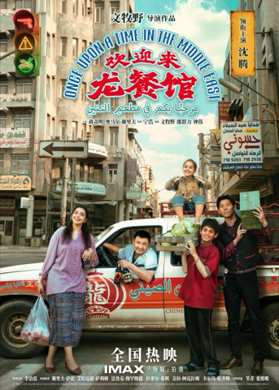
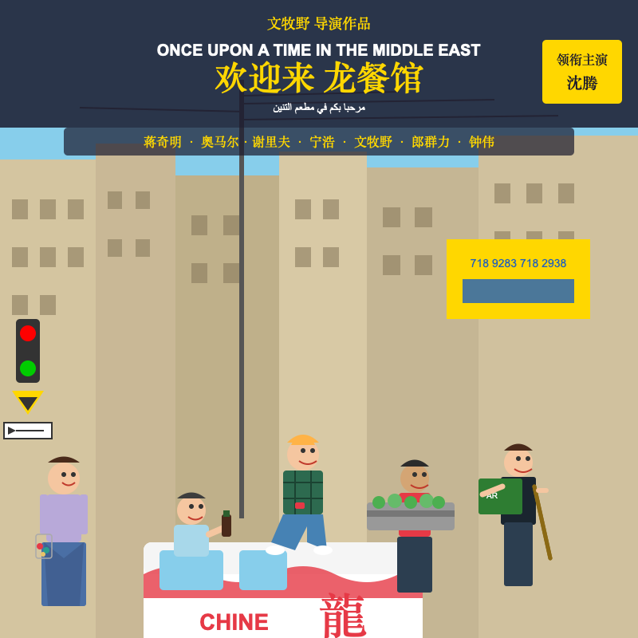
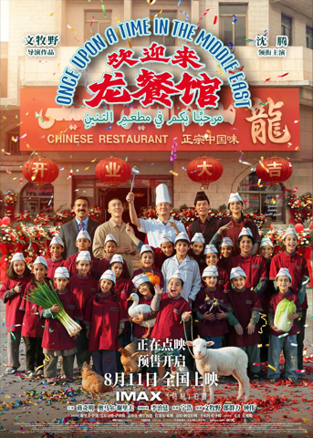
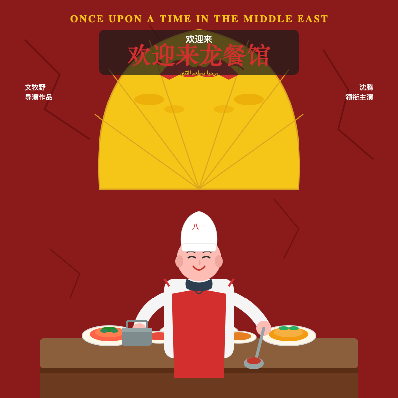

# DeepSeek 视觉多模态 — 图片理解与还原对比报告

- **模型**: `deepseek-v4-flash-vision-exp`
- **时间**: 20260821-113439
- **图片数**: 3

> 每张图三列对照：**原图**（左）｜**模型理解输出**（中）｜**还原图**（右，理解文本 → 再次调用视觉模型 → SVG → PNG）。

---

## 1. 《欢迎来龙餐馆》01.jpg

| 原图 | 模型理解输出 | 还原图（理解文本 → SVG → PNG） |
| ---- | ------------ | ------------------------------ |
|  | 这是一张摄影风格的电影海报，而非漫画或插画，因此画面中**没有漫画分格和对白框**，但包含了海报特有的文字排版元素。以下是详细的画面内容描述：  **整体概括与氛围** 海报展示了在一个中东国家（从阿拉伯文招牌判断）的街头，五位人物围绕着一辆白色车身、红色图案的小货车合影。整体氛围阳光明媚、轻松欢快、充满生活气息，带有喜剧色彩。画面色调明亮，天空呈淡蓝色，光线充足，展现了白日街头的景象。  **主体与场景** 背景是一条老旧的街道，两侧是多层楼房，建筑外墙斑驳，挂满了各种阿拉伯文招牌，其中右侧显眼处有一块黄底蓝字的广告牌，上面印有电话号码（718 9283 718 2938）。街道上方有一根电线杆，电线纵横交错。画面左侧有一处红绿灯，红灯亮起，下方是黄色的三角形警告标志，最下方是绿色的圆形灯光；红绿灯旁边还有一个指向左侧的箭头指示牌。  **人物/角色细节（从左至右）** 画面中有五位主要人物： 1. **左侧女性**：站在画面最左侧，穿着浅紫色长袖上衣和蓝底花纹长裙，脚穿浅色鞋。她面带微笑，左手提着一个装满水果/蔬菜的透明塑料袋，右臂微微弯曲。 2. **车内男性**（位于中间，从驾驶室车窗探出半个身子）：穿着浅蓝色短袖Polo衫，手里拿着一个深色玻璃瓶（类似饮料或啤酒瓶），面带微笑看着镜头。 3. **车顶女孩**：坐在白色货车的车顶上，盘腿而坐，穿着绿色格子短袖衬衫和蓝色牛仔裤，脚穿白色凉鞋。她双手放在膝盖上，手里拿着一个红色小物件（疑似玩具），笑容灿烂。 4. **右侧青少年**：站在货车右侧，穿着红色短袖T恤和深色长裤，双手端着一个装满绿色圆白菜的灰色塑料筐，微微侧身，带着开心的笑容。 5. **最右侧男性**：站在货车右后方，穿着深色衬衫并外搭深色马甲，下穿深色裤子和棕色皮鞋。他左手抱着一摞纸箱（最上面是绿色纸箱，印有阿拉伯文），右手扶着一根木棍，面带微笑。  **货车细节** 白色的货车车身有红色的波浪形涂装，以及一个巨大的繁体“龍”字。车身上还印有阿拉伯文和英文字母“CHINE”（中国）。车身上还有其他红色标语和装饰图案。  **文字与排版元素** 海报上方有巨大的中英文标题：英文为“ONCE UPON A TIME IN THE MIDDLE EAST”，中文主体为“欢迎来 龙餐馆”，标题下方还有阿拉伯文。标题上方写着“文牧野 导演作品”，右侧竖排黄色区域标注了“领衔主演 沈腾”。标题下方有一排演员和主创名单：蒋奇明、奥马尔·谢里夫、宁浩、文牧野、郎群力、钟伟。海报正下方有白色的“全国热映”字样以及“IMAX 特制拍摄”的Logo，最底部是一排小字体的联合出品人等信息。 |  |

- **SVG 源码**: `assets/recreated_from_text_《欢迎来龙餐馆》01.svg`
- **理解**: 14.0s（1895 token）｜**还原**: 42.7s（5630 token，1 次尝试）

---

## 2. 《欢迎来龙餐馆》02.webp

| 原图 | 模型理解输出 | 还原图（理解文本 → SVG → PNG） |
| ---- | ------------ | ------------------------------ |
|  | 这张图片是一部电影的宣传海报，整体画面细节丰富，以下是具体描述：  **一、主体与文字信息** 这是一张真人电影海报。画面顶部和中间有明确的文字： - 左上角写着“文牧野 导演作品”，右上角写着“沈腾 领衔主演”。 - 画面正上方是巨大的红色中文字体主标题**“欢迎来龙餐馆”**，其上方环绕着英文片名 **“ONCE UPON A TIME IN THE MIDDLE EAST”**，下方还有一行阿拉伯文。 - 红色招牌右侧有一个醒目的“龍”字。 - 招牌下方红色横幅上写着 **“CHINESE RESTAURANT”** 和 **“正宗中国味”**。 - 画面下方文字写着“正在点映 预售开启 8月11日全国上映 IMAX 特制拍摄”，底部还有一排细小的演职人员信息（编剧、导演、主演等名单）。  **二、人物与角色** 画面中央和前景是一大群正在合影的人，分为成年人和儿童两排：  - **后排成年人（从左到右）：**   1. 一位留着深色头发、身穿深色西装、系着领带的男士，面带微笑。   2. 一位身穿浅卡其色衬衫的男士（沈腾），微笑着站立。   3. 一位身穿白色厨师服、戴高高厨师帽的男士，右手高高举起一把银色汤勺。   4. 一位身穿深色外套、内搭红衣、额头上系着黑色头巾的男士，右手扶着头部，面带笑容。   5. 最右侧一位身穿红色外套、戴着白色厨师帽的男士，正笑着做出手势。  - **前排儿童：**   大约有十多名儿童，绝大多数统一穿着红色的厨师制服和白色厨师帽，面带开心的笑容。他们手里拿着各种食材：   - 左侧一名男孩双手抱着一大把绿色大葱。   - 中间偏左一名女孩抱着一只白色的鸭子（或鹅）。   - 她旁边另一名男孩也抱着白色的鸭子/鹅。   - 中间偏右一名男孩抱着一根紫色茄子。   - 最右侧一名男孩抱着一棵大白菜。   - 儿童群中有一名男孩穿着浅蓝色上衣而非红色制服。  **三、场景与背景** - 背景是一栋建筑的底层外观，似乎是餐馆的大门，上方是红色的招牌和横幅。 - 招牌下方悬挂着四个红灯笼，上面分别写着**“开”、“业”、“大”、“吉”**四个字。 - 餐馆门口两侧各摆放着大型鲜花花篮。 - 整个画面中飘落着大量彩色的纸屑（彩纸），地面上也布满了彩屑。  **四、动作与氛围** - **动作：** 所有人都在面对镜头摆拍合影，笑容灿烂；厨师举着汤勺，儿童展示着手中的食材，整体是一个“开业典礼合影”的姿态。 - **氛围：** 画面充满喜庆、欢乐、热闹的庆典氛围，色彩以红色为主，辅以彩纸的缤纷色彩，给人温暖、热烈的感觉。  **五、风格特点** - 这是一张**实拍风格的电影海报**，并非漫画或动画作品。 - 画面中**没有**漫画分格、对白框等元素。 - 采用的是一种“大合影”的构图方式，将标题放在顶部、演员信息和上映日期放在底部，人物居中，属于典型的院线电影宣发海报排版。 |  |

- **SVG 源码**: `assets/recreated_from_text_《欢迎来龙餐馆》02.svg`
- **理解**: 19.8s（2532 token）｜**还原**: 59.0s（7563 token，1 次尝试）

---

## 3. 《欢迎来龙餐馆》03.jpg

| 原图 | 模型理解输出 | 还原图（理解文本 → SVG → PNG） |
| ---- | ------------ | ------------------------------ |
|  | 这是一张电影海报，画面内容可以分为以下几个部分：  **1. 主体与人物/角色** 画面正中央是一位中年的男性厨师（根据海报文字可知由沈腾饰演）。他头戴白色的厨师帽（帽子正中间隐约有“八一”字样），身穿白色长袖厨师服，领口系着深色带花纹的领巾，外面系着一条红色的围裙。他的表情显得十分享受和开心，微微低头，双眼闭起，面带微笑。  **2. 场景与动作** 厨师正站在一张摆满食物的餐桌后方。他左手握着一个金属锅（或水壶），右手拿着一把长柄金属汤勺，正将一勺红色的浓郁汤汁/酱汁浇在面前盘子里的一只烤鸡上。画面最前方的桌面上摆放着多道菜品，包括烤鸡、带红色酱汁的菜肴、以及绿色的配菜等。  **3. 背景与氛围** 在厨师的正后方，立着一把巨大的黄色折扇，扇面上画着一条红色的中国龙和祥云图案。扇子的背景是一面深红色的墙面，墙面带有深浅不一的裂纹或斑驳的纹理。整个画面的色调以暖色（红色、黄色）为主，搭配热气腾腾的食物和厨师的笑容，营造出一种温暖、喜庆、充满欢迎气息和喜剧感的氛围。  **4. 风格特点** 这是一张典型的电影海报，并非漫画分格形式，因此没有对白框或分格。海报上包含大量的文字信息： *   **片名**：顶部有英文片名“ONCE UPON A TIME IN THE MIDDLE EAST”，中间有红色的中文片名“欢迎来龙餐馆”，中文片名上方是白色的“欢迎来”三个小字，下方还有一行阿拉伯文。 *   **演职信息**：左侧写着“文牧野 导演作品”，右侧写着“沈腾 领衔主演”。 *   **定档信息**：底部写着“8月8日-10日 14:00-21:00 超前点映”和“8月11日全国上映”。 *   **格式信息**：下方有“IMAX「特制」拍摄”的字样及“IMAX”标志。 *   **主创名单**：最底部有主演（蒋奇明、奥马尔·谢里夫等）、监制（宁浩等）以及摄影指导等幕后团队人员的长串名单。 |  |

- **SVG 源码**: `assets/recreated_from_text_《欢迎来龙餐馆》03.svg`
- **理解**: 11.7s（1716 token）｜**还原**: 39.7s（5114 token，1 次尝试）

