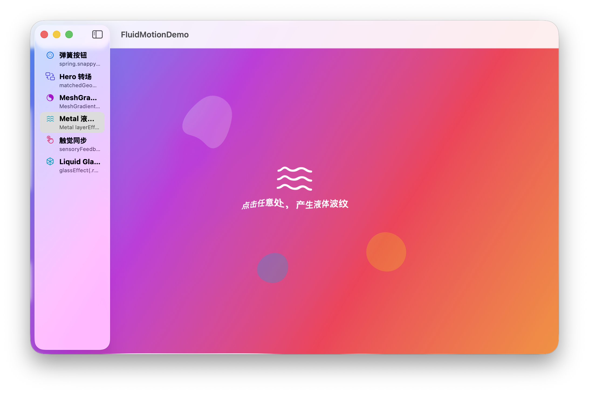
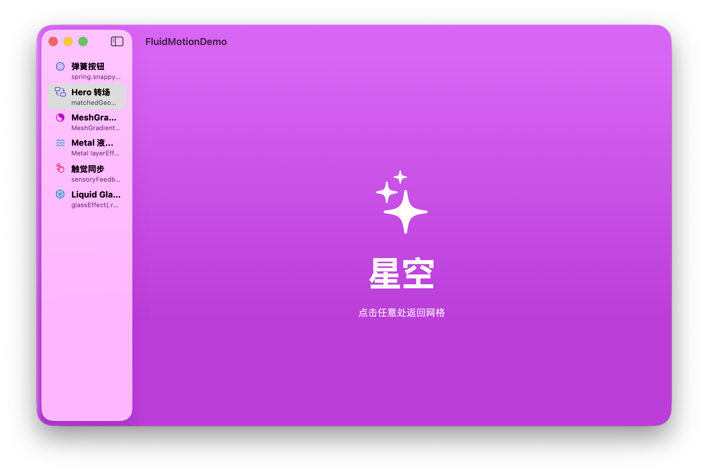

# fluid-motion-demo — Apple 平台顶级动效交互 Demo

> **落地「灵动动效设计语言」六配方的一个可运行 macOS SwiftUI Demo**——弹簧按钮、Hero 转场、MeshGradient 活背景、Metal 液体折射着色器、触觉同步、Liquid Glass 质感。
> 验证「物理正确 × 空间连续 × 内容插画 × 多感官同步 × 质感材质」的行业标杆动效方案。


## 效果预览

| MeshGradient 活背景 | Metal 液体折射 | Hero 转场 |
| :---: | :---: | :---: |
|  |  |  |

> 其余三个面板（弹簧按钮 / 触觉同步 / Liquid Glass 质感）在应用内切换查看。

## 背景

上游两份文档把「惊艳动效」拆成了可执行方案，本项目逐条落地验证：

- **调研报告** —— Apple 平台动效技术全景与业界顶流方案（Apple 文档 CDN 核验 + WWDC 一手来源）。
- **DESIGN.md（灵动动效设计语言）** —— 动效规范与指导原则：token 精确值 + 决策规则 + 代码配方 + 质量门禁（已同步到本仓库 [DESIGN.md](DESIGN.md)）。

## 核心技术方案

**一句话**：以「SwiftUI 声明式动画做结构层 + Metal 预编译着色器做天花板层 + AppKit 触觉做点睛层」三层架构，把 DESIGN.md 的 token 固化为 Swift 常量（`MotionTokens.swift` 单一事实来源），六配方各用一个面板落地。

### 技术要点（六配方 → 技术载体）

| 配方 | 核心技术 | 要点 |
| --- | --- | --- |
| 弹簧按钮 | SwiftUI `.spring(response:dampingFraction:)` | 三档 token：snappy 0.25/0.85、fluid 0.40/0.70、playful 0.55/0.50；`ButtonStyle` 捕获 `isPressed`，缩放与触觉同帧 |
| Hero 转场 | `matchedGeometryEffect(id:in:)` | `@Namespace` 共享元素，卡片 ↔ 详情双向 morph |
| MeshGradient | `MeshGradient(width:height:points:colors:)` | 4×4 网格 16 色，`withAnimation` 动画顶点漂移（角点不动） |
| Metal 液体折射 | 预编译 `.metal`→`.metallib` + `ShaderLibrary(url:)` + `layerEffect` | `[[ stitchable ]]` 函数用 `SwiftUI::Layer.sample()` 逐像素折射；`TimelineView(.animation)` 驱动 time，`SpatialTapGesture` 更新波纹原点 |
| 触觉同步 | AppKit `NSHapticFeedbackManager` | 与视觉弹簧同帧触发（`onChange` 绑定同一状态值） |
| Liquid Glass | `glassEffect(.regular, in:)` | macOS 26+，`#available` 守卫，旧系统降级提示 |

### 关键工程难点（为什么这么做）

1. **SwiftUI `Shader` 只认预编译库**：`Shader` / `ShaderFunction` 的参数类型是 `ShaderLibrary`（`.metallib`），**不接受运行时 `MTLLibrary`**。所以着色器必须 `xcrun metal` 预编译 → 作为资源打包 → `ShaderLibrary(url:)` 加载，而非 `makeLibrary(source:)` 运行时编译。
2. **`SwiftUI::Layer` 内联**：系统头 `SwiftUI_Metal.h` 自包含，内联进 `.metal` 规避 SwiftPM 编译时缺 include 路径。
3. **macOS 触觉走 AppKit**：SwiftUI `SensoryFeedback` 官方注明「仅 iOS/watchOS 播放」，macOS 是 no-op，改用 `NSHapticFeedbackManager`。
4. **单一可执行目标**：SwiftPM 库目标的 public API 会触发模块 emit（ObjC header + ABI descriptor）静默失败，故全 internal、测试用 `@testable import` 依赖可执行目标。

## 能力范围与限制（能力边界表）

| 能力 | 结论 / 说明 |
| --- | --- |
| 弹簧三档（snappy/fluid/playful） | ✅ SwiftUI `.spring` |
| Hero 转场 | ✅ `matchedGeometryEffect` 双向 morph |
| MeshGradient 活背景 | ✅ macOS 15+，顶点动画循环 |
| Metal 液体折射着色器 | ✅ 预编译 metallib + `ShaderLibrary(url:)` + `layerEffect`，真·逐像素折射采样 |
| 触觉反馈 | ⚠️ macOS 走 `NSHapticFeedbackManager`（Force Touch 触控板机型有效，桌面机型无操作）；SwiftUI `SensoryFeedback` 为 no-op |
| Liquid Glass | ⚠️ 需 macOS 26+，旧系统自动降级 |
| 平台 | macOS only（arm64）；watchOS / iOS 需另建 target |
| metallib 架构 | ⚠️ 预编译为 arm64；x86_64 需重跑 `scripts/compile_shaders.sh` |

## 快速开始

### 前置要求

- macOS 15+（MeshGradient 需要；Liquid Glass 面板需 macOS 26+）
- Xcode 26+（`swift` / `xcrun`）

### 构建 / 运行 / 验证

```bash
cd fluid-motion-demo
swift build            # → .build/arm64-apple-macosx/debug/FluidMotionDemo
swift run              # 启动 GUI（可选 --panel <spring|hero|mesh|liquid|haptics|glass> 直接定位面板）
swift test             # 3 项测试：Metal 着色器加载 + 弹簧 token 合法 + 时长 token 单调
```

### 重新编译着色器（仅修改 .metal 后）

```bash
scripts/compile_shaders.sh   # shaders/*.metal → Sources/FluidMotionDemo/*.metallib
```

> metallib 已提交入库，`swift build/run/test` 无需该脚本。

## 架构

```
fluid-motion-demo/
├── DESIGN.md                      # 灵动动效设计语言（规范 + 指导原则，与 docss 同步）
├── Package.swift                  # 单一可执行目标 + 测试目标（swiftLanguageModes: v5）
├── shaders/LiquidRefraction.metal # 液体折射 MSL（内联 SwiftUI::Layer，自包含）
├── scripts/compile_shaders.sh     # .metal → .metallib（arm64）
├── Sources/FluidMotionDemo/
│   ├── FluidMotionDemoApp.swift   # @main + --panel 启动参数 + SPM 无 bundle 前台激活
│   ├── ContentView.swift          # NavigationSplitView 侧栏 + 6 面板切换
│   ├── MotionTokens.swift         # DESIGN.md token → Swift 常量（单一事实来源）
│   ├── SpringAliases.swift        # spring.snappy/fluid/playful/gentle 动画别名
│   ├── Haptics.swift              # macOS 触觉（NSHapticFeedbackManager）
│   ├── MetalShaders.swift         # metallib 加载 + refractionShader 构造
│   ├── SpringButtonPanel.swift    # 面板一：弹簧按钮
│   ├── HeroTransitionPanel.swift  # 面板二：Hero 转场
│   ├── MeshGradientPanel.swift    # 面板三：MeshGradient 活背景
│   ├── LiquidShaderPanel.swift    # 面板四：Metal 液体折射
│   ├── HapticsPanel.swift         # 面板五：触觉同步
│   └── GlassEffectPanel.swift     # 面板六：Liquid Glass（macOS 26+）
├── Tests/FluidMotionDemoTests/    # @testable import 可执行目标
└── docs/demo/                     # README 演示图（可提交）
```

## 测试

```bash
swift test    # 3 tests：testMetalRefractionShaderLoads / testSpringTokensArePhysicallySane / testDurationTokensAreMonotonic
```

`testMetalRefractionShaderLoads` 是「着色器可落地」的最强客观证据——真正加载预编译 metallib、取到 `liquidRefraction` stitchable 函数并构造 `Shader`。

## 文档

- **[SPEC.md](SPEC.md)** — 可复现规格：任何 AI 代理拿到即可重建完整 Demo（含 9 条踩坑记录与验收标准）
- **[DESIGN.md](DESIGN.md)** — 灵动动效设计语言（规范 + 指导原则）

## License

MIT。本 Demo 为动效方案的技术落地验证，无企业数据资产。
