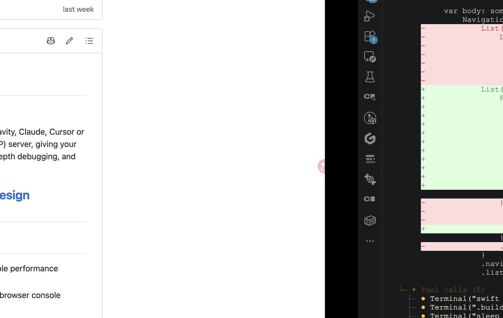
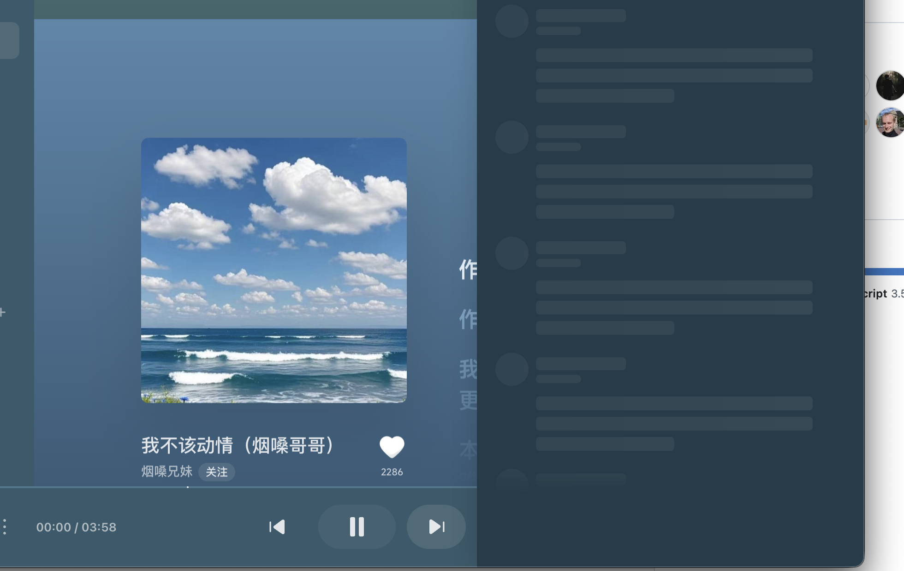

# fluid-motion-demo — Apple 平台顶级动效交互 Demo

> **落地「灵动动效设计语言」的五件套 + Liquid Glass 质感，一个可运行的 macOS SwiftUI 动效 Demo。**
> 验证「物理正确 × 空间连续 × 内容插画 × 多感官同步 × 质感材质」的行业标杆动效方案——不是「能用」，而是「惊艳」。


## 效果预览

| 弹簧按钮（snappy / fluid / playful + 触觉） | MeshGradient 活背景（16 色网格渐变漂移） |
| :---: | :---: |
|  |  |

> 其余四个面板（Hero 转场 / Metal 液体折射 / 触觉同步 / Liquid Glass 质感）在应用内切换查看。

## 背景

前期产出了两份调研文档，本项目把其中的「惊艳动效」方案落地为可运行 Demo：

- **[调研报告](https://doc.weixin.qq.com/smartpage/a1_AIAAF3hiAKgCN0gTMfnorR5SjNZip_a)** —— Apple 平台动效技术全景与业界顶流方案（Apple 文档 CDN 核验 + WWDC 一手来源）。
- **[DESIGN.md（灵动动效设计语言）](https://doc.weixin.qq.com/smartpage/a1_AIAAF3hiAKgCNwmFGXjL0SAGvxcfc_a)** —— 动效规范与指导原则：token 精确值 + 决策规则 + 代码配方 + 质量门禁。

本 Demo 逐条验证 DESIGN.md 的五个核心配方 + 质感层：

1. **弹簧按钮**（结构层）—— `spring.snappy / fluid / playful` 三档弹簧，按下缩放、松手回弹，触觉同帧。
2. **Hero 转场**（结构层）—— `matchedGeometryEffect` 让卡片「旅行」为全屏详情。
3. **MeshGradient 活背景**（天花板层）—— 4×4 网格渐变顶点持续漂移（gentle 4s 循环）。
4. **Metal 液体折射**（天花板层）—— 预编译 `.metal` → `.metallib`，`ShaderLibrary(url:)` + `layerEffect` 实现真·折射波纹。
5. **触觉同步**（点睛层）—— `NSHapticFeedbackManager` 与视觉弹簧同帧触发。
6. **Liquid Glass 质感**（质感层，macOS 26+）—— `glassEffect(.regular)` 玻璃折射卡片。

## 能力范围与限制（能力边界表）

| 能力 | 结论 / 说明 |
| --- | --- |
| 弹簧三档（snappy/fluid/playful） | ✅ SwiftUI `.spring(response:dampingFraction:)` |
| Hero 转场 | ✅ `matchedGeometryEffect`，卡片 ↔ 详情双向 morph |
| MeshGradient 活背景 | ✅ macOS 15+，顶点动画循环 |
| Metal 液体折射着色器 | ✅ 预编译 metallib + `ShaderLibrary(url:)` + `layerEffect`，真·逐像素折射采样 |
| 触觉反馈 | ⚠️ macOS 走 `NSHapticFeedbackManager`（Force Touch 触控板机型有效，桌面机型无操作）；SwiftUI `SensoryFeedback` 官方标注「仅 iOS/watchOS 播放」，macOS 上为 no-op |
| Liquid Glass | ⚠️ 需 macOS 26+（`glassEffect`），旧系统自动降级提示 |
| 平台 | macOS only（arm64）；watchOS / iOS 需另建 target |
| metallib 架构 | ⚠️ 预编译为 arm64；x86_64 需重跑 `scripts/compile_shaders.sh` |

## 快速开始

### 前置要求

- macOS 15+（MeshGradient 需要；Liquid Glass 面板需 macOS 26+）
- Xcode 26+（`swift` / `xcrun`）

### 构建与运行

```bash
cd fluid-motion-demo
swift build            # → .build/arm64-apple-macosx/debug/FluidMotionDemo
swift run              # 启动 GUI（或直接运行上述二进制）
```

### 验证

```bash
swift test             # 3 项测试：Metal 着色器加载 + 弹簧 token 合法 + 时长 token 单调
```

### 重新编译着色器（仅修改 .metal 后）

```bash
scripts/compile_shaders.sh   # shaders/*.metal → Sources/FluidMotionDemo/*.metallib
```

> metallib 已提交入库，`swift build/run/test` 无需该脚本；仅改动着色器源码时才需要。

## 架构

```
fluid-motion-demo/
├── Package.swift                  # 单一可执行目标 + 测试目标（swiftLanguageModes: v5）
├── shaders/
│   └── LiquidRefraction.metal     # 液体折射 MSL（内联 SwiftUI::Layer，自包含）
├── scripts/
│   └── compile_shaders.sh         # .metal → .metallib（arm64）
├── Sources/FluidMotionDemo/
│   ├── FluidMotionDemoApp.swift   # @main + AppDelegate（SPM 无 bundle，手动前台激活）
│   ├── ContentView.swift          # NavigationSplitView 侧栏 + 6 面板切换
│   ├── MotionTokens.swift         # DESIGN.md token → Swift 常量（单一事实来源）
│   ├── SpringAliases.swift        # spring.snappy/fluid/playful/gentle 动画别名
│   ├── Haptics.swift              # macOS 触觉（NSHapticFeedbackManager）
│   ├── MetalShaders.swift         # metallib 加载 + refractionShader 构造
│   ├── SpringButtonPanel.swift    # 面板一：弹簧按钮 + SpringPressStyle
│   ├── HeroTransitionPanel.swift  # 面板二：Hero 转场
│   ├── MeshGradientPanel.swift    # 面板三：MeshGradient 活背景
│   ├── LiquidShaderPanel.swift    # 面板四：Metal 液体折射
│   ├── HapticsPanel.swift         # 面板五：触觉同步
│   └── GlassEffectPanel.swift     # 面板六：Liquid Glass（macOS 26+）
├── Tests/FluidMotionDemoTests/    # @testable import 可执行目标
└── docs/demo/                     # README 演示图（可提交）
```

## 测试

```bash
swift test    # 3 tests：testMetalRefractionShaderLoads / testSpringTokensArePhysicallySane / testDurationTokensAreMonotonic
```

关键测试 `testMetalRefractionShaderLoads` 是「着色器可落地」的最强客观证据——它真正加载预编译 metallib、取到 `liquidRefraction` stitchable 函数并构造 `Shader`，而非「看起来能编译」。

## 关键工程决策

| 决策 | 理由 |
| --- | --- |
| 单一可执行目标（全 internal） | SwiftPM library 目标的 public API 会触发模块 emit（ObjC header + ABI descriptor）失败；并入可执行目标规避 |
| 预编译 metallib + `ShaderLibrary(url:)` | SwiftUI `Shader`/`ShaderFunction` 只接受预编译 `ShaderLibrary`，不接受运行时 `MTLLibrary` |
| `SwiftUI::Layer` 内联进 .metal | 自包含，规避 SwiftPM 编译 .metal 时缺 SwiftUI include 路径 |
| macOS 触觉用 `NSHapticFeedbackManager` | SwiftUI `SensoryFeedback` 在 macOS 是 no-op（官方注明仅 iOS/watchOS） |
| token 常量单一事实来源（`MotionTokens.swift`） | 视图禁止硬编码魔法数字，全部走 token |

## 文档

- **[SPEC.md](SPEC.md)** — 可复现规格：任何 AI 代理拿到即可重建完整 Demo（含全部踩坑记录与验收标准）
- DESIGN.md（灵动动效设计语言）—— 见 docss 交付物
- 调研报告 —— 见 docss 交付物

## License

MIT。本 Demo 为动效方案的技术落地验证，无企业数据资产。
