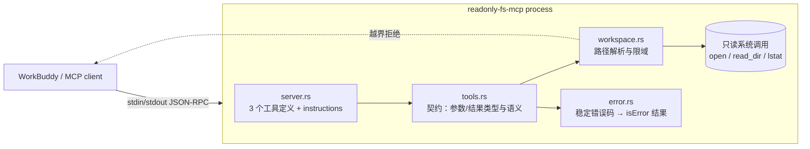

# readonly-fs-mcp-mvp

一个**只读、限域、只走 stdio** 的本地文件系统 MCP Server（Rust）。启动时指定一个工作目录，向 MCP 客户端暴露 3 个工具：目录列表、文本读取、元数据查看。它没有任何写、移动、删除的能力——不是"约定不写"，而是代码里不存在这些 API。


-lightgrey.svg)

## 能力一览

| 工具 | 做什么 | 关键返回 |
| ---- | ------ | -------- |
| `list_directory` | 列目录（可递归、可控隐藏文件、有条目预算） | `entries[]`（名称/相对路径/类型/大小/修改时间/层级）、`truncated`、`unreadable[]` |
| `read_file` | 按行范围读 UTF-8 文本（可翻页） | `content`、`start_line`/`end_line`、`total_lines`、`truncated` |
| `file_metadata` | 看一个路径的元数据（不跟随符号链接） | 类型、大小、时间、`mode_octal`/`permissions`、uid/gid、inode、硬链接数、`symlink_target`、`escapes_workspace`、`looks_like_text` |

三个工具都声明了 MCP 注解 `readOnlyHint: true` / `destructiveHint: false` / `idempotentHint: true` / `openWorldHint: false`，并带 `outputSchema`——客户端可以据此在 UI 层把能力标成只读。

## 背景

本地 AI Agent（WorkBuddy、Claude Code 一类）需要"看一眼工作目录里有什么"，但给它一个通用的文件工具（能读能写能删）风险太高：一次误判就可能改坏文件。这里把需求拆成两半——**给足"看"的能力，彻底不给"改"的能力**：

1. **只读**：源码里不存在 `File::create` / `OpenOptions` / `fs::remove_*` / `fs::write` 等 API，由 `tests/guard_read_only.rs` 扫描源码强制执行（不是文档约定）。
2. **限域**：所有路径先 canonicalize 再判是否落在工作目录内，`..` 与指向外部的符号链接一律拒绝；`file_metadata` 对指向外部的链接只报告"它出去了"，不泄露目标路径。
3. **只本机可达**：只走 stdio（父进程的管道），不监听任何端口——`tests/guard_read_only.rs` 同时禁止网络 API 出现在源码里。

## 关键决策

| 决策 | 选择 | 理由 |
| ---- | ---- | ---- |
| 传输 | **stdio**，不做 HTTP | "仅本机可访问"的最强形态是没有 socket；HTTP 即使绑 127.0.0.1 也引入端口、鉴权与并发面 |
| 框架 | 官方 Rust SDK `rmcp 3.4`（`#[tool_router]` / `#[tool]`） | 工具的参数与输出 schema 由 Rust 类型直接派生（代码即定义），注解、`structuredContent`、协议版本协商都由 SDK 处理 |
| 结果形态 | `Json<T>`（结构化）+ 工具级错误 | 成功路径给出强类型 JSON，同时附一份等价文本；失败走 `isError: true` 并带稳定 `code`，模型可据此分支而不是猜散文 |
| 未知参数 | `serde(deny_unknown_fields)` | 拼错参数名（如 `includeHidden`）宁可显式报错，也不能静默按默认值执行——静默忽略会给出错误答案 |
| 路径解析 | canonicalize 后判前缀；读走"跟随"，元数据走"不跟随" | 读内容必须证明真实目标在域内；看元数据要能看见符号链接本身 |
| 符号链接 | 列目录时列出但不跟随进入 | 跟随会带来环与越界两条风险，列出即足够模型决策 |
| 预算 | 行数/条目/深度/字节四类上限，都可被调用方调小、被服务端夹住 | 防止一次调用吃掉上下文；超限用 `truncated` 显式告知而不是截断后沉默 |
| 二进制文件 | `read_file` 直接拒绝（`not_text`） | 文本读取器返回乱码比拒绝更糟；`file_metadata.looks_like_text` 提前给出可否读的答案 |

## 架构



模块职责（每个模块只依赖它下面那层）：

| 文件 | 职责 |
| ---- | ---- |
| `src/server.rs` | MCP 绑定：三个 `#[tool]`、注解、`instructions`（把工作目录与规则告诉模型）、`serve_stdio` |
| `src/tools.rs` | 工具契约：参数/结果类型（`JsonSchema` 从类型派生）+ 纯函数实现 |
| `src/workspace.rs` | `Workspace`（根目录 + 预算）、`resolve_followed`（读）、`locate`（元数据） |
| `src/error.rs` | `FsError`：9 个稳定错误码与结构化错误载荷 |
| `src/cli.rs` | `--root` 与预算参数、启动期校验、诊断输出（stderr） |

## 工具契约

### `list_directory`

| 参数 | 类型 | 默认 | 说明 |
| ---- | ---- | ---- | ---- |
| `path` | string? | 工作目录根 | 相对根解析；绝对路径必须在根内 |
| `include_hidden` | bool | `false` | 是否含点文件/点目录 |
| `recursive` | bool | `false` | 是否递归（始终不跟随符号链接） |
| `max_depth` | int? | `2` | 递归层级，服务端上限 8；`recursive=false` 时忽略 |
| `max_entries` | int? | `200` | 返回条目上限，服务端上限 2000 |

返回：`root`、`path`、`entries[]`（BFS，同级按名称排序）、`entry_count`、`truncated`、`unreadable[]`（权限不足而未能读取的子目录，明确告知"是缺了，不是没有"）。

### `read_file`

| 参数 | 类型 | 默认 | 说明 |
| ---- | ---- | ---- | ---- |
| `path` | string | 必填 | 必须是根内可解析的普通文件 |
| `start_line` | int? | `1` | 1-based；`0` 会被显式拒绝（`invalid_parameter`） |
| `max_lines` | int? | `200` | 服务端上限 2000 |

返回：`content`（请求行以 `\n` 连接，无尾随换行）、`size_bytes`、`total_lines`（读到文件末尾才给准确值，否则 `null`）、`start_line`/`end_line`、`returned_lines`、`truncated`。翻页方式：`start_line = end_line + 1`。

### `file_metadata`

参数：`path`（string，必填）。返回见"能力一览"。语义要点：

- 用 `lstat` 看**条目本身**；路径自身必须在根内（父链 canonicalize 后再判前缀）。
- 符号链接：目标是根内路径时给出 `symlink_target`；目标是根外时 `escapes_workspace: true` 且**不给目标字符串**；悬空链接两者都为假。
- `looks_like_text`：文件前 4 KiB 是合法 UTF-8 且不含 NUL 则为 `true`（被窗口截断的多字节字符不算错）。

### 错误码（`structuredContent.code`）

| code | 触发 |
| ---- | ---- |
| `outside_workspace` | 解析后落在工作目录之外（含 `..` 逃逸、指向外部的符号链接） |
| `not_found` | 路径不存在 |
| `not_a_file` | 目标是目录/设备/套接字等非普通文件 |
| `not_a_directory` | 期望目录却给了文件 |
| `permission_denied` | 无权限读取 |
| `not_text` | 非 UTF-8 或含 NUL（`message` 里带首个非法行号） |
| `line_too_large` | 单行超过本次调用的字节预算，无法成行返回 |
| `invalid_parameter` | 参数非法（空路径、含 NUL、`start_line=0`） |
| `io_error` | 其余 I/O 失败（附原始错误） |

## 快速开始

```bash
cd quest-mvp-lab/readonly-fs-mcp-mvp
cargo build --release          # 产物：target/release/readonly-fs-mcp
./scripts/verify.sh            # 格式 + clippy + 全部测试 + 行覆盖率门槛（95%）
```

手工冒烟（stdin 里发两行 JSON-RPC 即可）：

```bash
printf '%s\n%s\n' \
  '{"jsonrpc":"2.0","id":1,"method":"initialize","params":{"protocolVersion":"2025-06-18","capabilities":{},"clientInfo":{"name":"probe","version":"0"}}}' \
  '{"jsonrpc":"2.0","id":2,"method":"tools/list"}' \
  | ./target/release/readonly-fs-mcp --root ~/workspace/quest-mvp-lab | head -c 400
```

### 接入 WorkBuddy

编辑 `~/.workbuddy/mcp.json`，在 `mcpServers` 下加一项（stdio 形态，WorkBuddy 由 `command` 推断 `type: "stdio"`）：

```json
{
  "mcpServers": {
    "readonly-fs": {
      "type": "stdio",
      "command": "/Users/<你的用户名>/workspace/quest-mvp-lab/readonly-fs-mcp-mvp/target/release/readonly-fs-mcp",
      "args": ["--root", "/Users/<你的用户名>/workspace"],
      "disabled": false
    }
  }
}
```

> WorkBuddy 不展开 `~`，`command` 与 `--root` 都要写绝对路径（`echo $HOME` 取前缀）。

改完重启会话（工具在会话启动时注册）。要换工作目录只改 `args` 里的 `--root`；同一份二进制可以用多个 server 名字挂不同目录。

## 命令与退出码

```
readonly-fs-mcp [--root DIR] [--max-read-lines N] [--max-entries N]
                [--max-depth N] [--max-read-bytes BYTES] [--max-scan-bytes BYTES]
```

| 参数 | 默认 | 作用 |
| ---- | ---- | ---- |
| `--root` | 当前目录 | 唯一可读目录，启动时 canonicalize 并锁定 |
| `--max-read-lines` | `2000` | `read_file` 单次行数上限（服务端夹住调用方请求） |
| `--max-entries` | `2000` | `list_directory` 单次条目上限 |
| `--max-depth` | `8` | 递归深度上限 |
| `--max-read-bytes` | `524288` | 单次返回文本的字节预算 |
| `--max-scan-bytes` | `8388608` | 小于此大小的文件会被读到末尾，从而给出准确 `total_lines` |

退出码：`0` 正常结束（stdin 关闭）；`2` 启动失败（根目录不可解析/不是目录），原因写 stderr，stdout 始终只有协议字节。

## 实测结果

命令：`./scripts/verify.sh`（日志在 `runs/<时间戳>/verify.log`，不入库）。

| 项目 | 结果 |
| ---- | ---- |
| 单元测试（`src/`，含 workspace/tools/server/cli/error） | **49 passed** |
| 端到端（`tests/mcp_stdio.rs`，真进程 + stdio + 官方 client） | **8 passed** |
| 守卫测试（`tests/guard_read_only.rs`，扫源码） | **7 passed** |
| 合计 | **64 passed / 0 failed** |
| 行覆盖率（`cargo llvm-cov --fail-under-lines 95`） | **98.85%**（1388 行中 16 行未覆盖；`main.rs` 100%、`server.rs` 99.49%、`cli.rs` 99.08%、`error.rs` 99.14%、`workspace.rs` 98.86%、`tools.rs` 98.54%） |
| `cargo clippy --all-targets -- -D warnings` | 通过 |
| `cargo fmt --all --check` | 通过 |

端到端测试覆盖的**真实证据**（不是描述，是断言）：

- `stdout_carries_json_rpc_lines_only`：拿裸管道发 `initialize` + `tools/list`，逐行断言 stdout 是合法 JSON-RPC（无日志污染），关闭 stdin 后进程自行退出且退出码 0。
- `no_call_ever_changes_the_workspace`：调用前对整棵目录树做快照（名称/类型/大小/权限/mtime/文件字节），9 次调用（含越界与报错）后逐项比对必须**完全一致**。
- `reads_succeed_on_a_write_protected_workspace`：把工作目录 `chmod 555` 后再列目录+读文件，依然成功——证明读路径不需要任何写权限。
- `failures_arrive_as_tool_errors_with_stable_codes`：10 组越界/类型/参数错误，逐条断言 `isError: true` 且 `code` 与文本块一致。
- `a_root_that_cannot_be_used_fails_loudly`：给一个不存在的 `--root`，进程退出码 2、stderr 说明原因、stdout 为空。
- `tests/guard_read_only.rs`：源码中不得出现任何文件改写 API、任何网络 API、任何 `unsafe`；三个工具各声明一次且都标了 `readOnlyHint`/`destructiveHint`。

## 取舍

- **只做 3 个工具**：没有搜索/正则/写覆盖工具。需要"找文件"的场景，靠 `list_directory(recursive)` + 元数据已能收敛；多一个动词就多一份越界与误用面。用户在真实使用中若确认需要，再单独加（仍将是只读语义）。
- **不做 HTTP 传输**：断开了"浏览器/其他进程也能连"的可能，代价是无法给非 stdio 的客户端复用。
- **同步 I/O 直接跑在 tokio 上**：单客户端 stdio 场景，读取有字节预算，不引入 `spawn_blocking` 的复杂度。
- **`file_metadata` 不跟随符号链接**：想看目标内容就先 `read_file`（域内才允许），元数据工具只回答"这个条目本身是什么"。
- **Unix-only**：权限位、uid/gid、inode 等字段来自 `std::os::unix`；Windows 需要另写一版字段映射。

## 目录结构

```
readonly-fs-mcp-mvp/
├── src/
│   ├── main.rs        # 入口：只做退出码映射
│   ├── lib.rs         # 模块装配与再导出
│   ├── cli.rs         # --root 与预算参数、启动校验
│   ├── server.rs      # MCP 工具定义、注解、instructions、serve_stdio
│   ├── tools.rs       # 三个工具的契约与实现（含单元测试）
│   ├── workspace.rs   # 限域路径解析（含单元测试）
│   └── error.rs       # 稳定错误码 → 工具级错误（含单元测试）
├── tests/
│   ├── mcp_stdio.rs        # 端到端：真进程 + stdio + 官方 client + 快照证明
│   └── guard_read_only.rs  # 守卫：源码无改写 API / 无网络 / 无 unsafe
├── scripts/verify.sh  # 一键验证（含覆盖率门槛）
├── SPEC.md            # 实现方契约（数据契约、CLI、验收清单）
└── README.md
```

## 结论

这个 MVP 证明了：**把"看"和"改"彻底切开，比在一个通用文件工具上加权限开关更可靠**。删除文件的能力不是被限制，而是不存在——源码守卫、类型契约与端到端快照三重证据都指向同一条结论，且整套能力（3 个工具、64 个测试、`cargo llvm-cov` 行覆盖率 97%）落在一个可一键复验的命令里。
