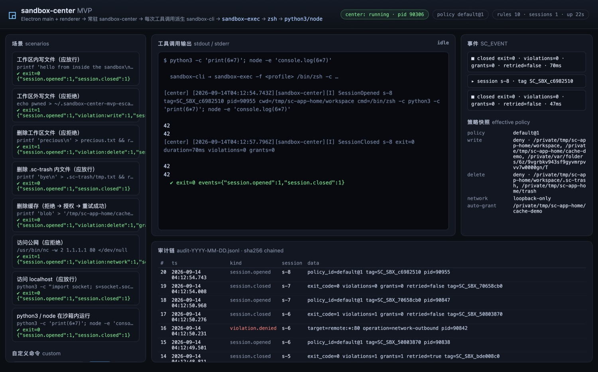

# sandbox-center-mvp

AI Agent **工具调用沙箱**的最小可运行实现：Electron 主进程 + Helper/渲染进程 +
**常驻 `sandbox-center`** + 每次工具调用派生
`sandbox-cli → /usr/bin/sandbox-exec → zsh → python3/node/file`。

沙箱不是"给 prompt 加一句请勿越权"，而是**内核强制**：文件写白名单、删除保护、
仅 loopback 出网，全部由 Seatbelt（SBPL）在 `sandbox-exec` 里执行；每一次越权尝试
都被回捞成结构化事件，落到 **sha256 链式审计**里。



## 背景

桌面 AI Agent 的每个"工具调用"实际上都是一段以用户身份运行的任意命令。仅靠权限
弹窗（approve/deny）既挡不住提示注入，也撑不住自动化：审批疲劳会让用户闭眼点"允许"。
参考实现（Electron 桌面 Agent）给出的答案是三层结构：

1. **常驻决策中心**（`sandbox-center`）：持有策略、会话账本、审计链，进程外可独立升级；
2. **一次性执行入口**（`sandbox-cli`）：每次工具调用一个新进程，向中心要策略、
   生成 profile、`execvp(sandbox-exec)`，把内核拒绝回捞成审计事件；
3. **内核强制**（Seatbelt）：策略之外一律拒绝，拒绝事实**不依赖被管控进程自述**。

本 MVP 复刻这条链路并做到可验证：**策略 → SBPL → 内核拒绝 → 回捞 → 中心决策 →
（可选）授权重试 → 审计链**，全流程有自动化证据。

## 架构

### 进程模型

```
Electron main（窗口/菜单/IPC 桥；不持有业务）
 ├─ Helper (GPU) / Helper (Renderer) …            ← 只渲染，sandboxed renderer
 ├─ sandbox-center（常驻子进程，Unix socket）
 │    ├─ 策略文件 → 有效策略（${WORKSPACE}/${TMPDIR}/… 占位符展开 + realpath 归一）
 │    ├─ 会话账本：session_id / SC_SBX tag / 违规计数 / 授权计数
 │    └─ 审计：audit-YYYY-MM-DD.jsonl（sha256 链，逐条 prev/hash）
 └─ 每次工具调用派生 sandbox-cli（一次性）
      └─ /usr/bin/sandbox-exec -f <profile>  →  zsh  →  python3 / node / file / nc …
```

### 一次工具调用的完整链路

```
renderer  ──IPC──▶  main  ──spawn──▶  sandbox-cli
                                       │ ①open_session（cwd/argv/workspace）
                                       │ ─────────────▶ sandbox-center
                                       │ ◀── 有效策略 + 会话 SC_SBX_<hex> tag
                                       │ ②写 profile 到 $TMPDIR/sandbox-center-mvp/<tag>.sb (0600)
                                       │ ③sandbox-exec -f profile zsh -c <cmd>      ← 内核强制
                                       │ ④log show 回捞 tag 关联的拒绝记录
                                       │ ⑤report_violation ×N ─▶ center（allow / auto-grant）
                                       │ ⑥若 center 授权：追加 grant 根重新生成 profile 并重试一次
                                       └ ⑦close_session ─▶ center（封账）
main  ──托管/转发──▶  renderer 显示 stdout/stderr + SC_EVENT 事件 + 审计尾
```

### 组件职责

| 组件 | 语言 | 职责 | 明确不做 |
| --- | --- | --- | --- |
| `sandbox-center` | Rust | 策略解析、会话账本、自动授权决策、审计链、Unix socket RPC | 不执行用户命令；不做网络过滤代理 |
| `sandbox-cli` | Rust | 生成 SBPL、`sandbox-exec`、输出透传、拒绝回捞、授权重试 | 不自持策略；不缓存会话 |
| Electron main | JS | 托管 center、桥接 IPC、派生 CLI、把 SC_EVENT 分流给 UI | 不解析策略；不直接跑命令 |
| renderer/preload | JS | 场景面板、控制台、事件流、审计视图 | `nodeIntegration:false`，contextBridge 白名单 13 个方法 |

## 关键决策

| 决策 | 取舍 | 依据 |
| --- | --- | --- |
| **策略权威在 center，执行在 CLI** | CLI 无状态、可被杀可重启；center 改策略无需改 CLI | 与参考实现一致：中心常驻、入口一次性 |
| **拒绝语义用 Seatbelt"最后匹配生效"** | 先宽后窄：`allow file-write*` → `deny file-write-unlink (subpath "/")` → 窄域 `allow file-write-unlink` | 删除保护必须能覆盖宽写权限；实测最后匹配生效 |
| **`(deny default (with message "<tag>"))` 打标** | 每条拒绝都带唯一 tag，才能归属到具体一次调用 | 一个 tag 对应一次工具调用，`log show --predicate` 精确取回 |
| **显式 deny 规则同样带 message** | 一开始只给 default 打了标，结果"删除保护"类拒绝**完全静默**（实测踩坑） | 拒绝消息来自**命中的那条规则**，不是 profile 全局 |
| **拒绝回捞走 `log show`（而非 stderr）** | 固定 ~0.7s 尾部开销；换取"内核事实"而非进程自述 | macOS 26 上 `sandbox-exec` 不再向 stderr 打印违规，且内核 sandbox 事件**不进 `log stream`** |
| **auto-grant 后重跑一次** | 首次必然失败一次；换来"中心决策 → 执行面生效"的闭环 | 与参考实现 `auto_grant` 规则同构；重跑仅在授权命中时发生 |
| **审计 sha256 链** | 每条 `hash = sha256(prev ‖ body)`；改写/删行/换序立刻验签失败 | 让"谁在什么时候被拒/被授权"可自证 |
| **`subpath` 语义 + realpath 归一** | `/tmp` → `/private/tmp` 归一后才写进 profile | Seatbelt 按真实路径匹配；不归一会静默失效或越权 |

## 策略模型

策略文件是一份可读 JSON（`policy/*.json`），支持 `${WORKSPACE}` `${APP_HOME}` `${TMPDIR}` `${HOME}` 占位符；
所有根都是 **subpath**（含自身及其子孙），解析时统一 realpath 归一。

```json
{
  "version": 1,
  "name": "default",
  "read":   { "allow": ["/"] },
  "write":  { "default": "deny",  "allow": ["${WORKSPACE}", "${APP_HOME}/cache-demo", "${TMPDIR}"] },
  "delete": { "default": "deny",  "allow": ["${WORKSPACE}/.sc-trash", "${APP_HOME}/trash"] },
  "network": { "mode": "loopback-only", "unix_socket_outbound": true },
  "auto_grant": [
    { "root": "${APP_HOME}/cache-demo", "operations": ["write", "delete"],
      "reason": "regenerable cache owned by the agent" }
  ]
}
```

| 文件 | 语义 | 用途 |
| --- | --- | --- |
| `default-policy.json` | 写白名单 + 删除保护 + 仅 loopback + 缓存自动授权 | 默认演示策略 |
| `strict-policy.json` | 同前，但网络**完全禁止**（连 loopback 也拒） | 证明网络档位可收敛 |
| `workbuddy-policy.json` | 写全局放行、**只保护删除**（`/tmp`、`/var/tmp`、`/dev` 除外） | 复刻参考实现的"可逆操作"语义 |

## 目录结构

```
sandbox-center-mvp/
├── core/                              # Rust workspace
│   ├── crates/sandbox-core/           # 协议 / 策略 / SBPL 生成 / 拒绝解析 / IPC / 时间
│   ├── crates/sandbox-center/         # 常驻中心（含 audit.rs 链式审计、logging.rs）
│   └── crates/sandbox-cli/            # 一次性执行入口 + tests/e2e.rs
├── app/                               # Electron 外壳（main / preload / renderer）
├── policy/                            # 三套策略：default / strict / workbuddy
├── scripts/demo.sh                    # 终端演示（无需 GUI）
├── docs/ui.jpg                        # 控制台截图
└── Makefile                           # build / test / verify / demo
```

## 构建

```bash
make build            # cargo build --release + npm install
# 或分开：
make build-core       # core/target/release/{sandbox-center,sandbox-cli}
make build-app        # app/node_modules（Electron 40）
```

前置：macOS（Seatbelt）、Rust 1.96、Node 22、`/usr/bin/sandbox-exec`、`/usr/bin/log`。

## 运行

```bash
make demo             # 终端演示：8 个场景 + 审计链验签，不需要 GUI
make verify-app       # Electron 自检（隐藏窗口跑完 8 个场景 + UI 断言 + 截图）
cd app && npm start   # 打开控制台（默认 app home: ~/.sandbox-center-mvp）
```

控制台里每个场景按钮都会真的派生 `sandbox-cli`；`SC_EVENT|{json}` 事件流会渲染成
右侧"事件"卡片，审计尾部 2 秒刷新一次。

## 验证

```bash
make verify           # = make test + make verify-app
make test-unit        # 39 个 Rust 单测（0.1s）
make test-e2e         # 13 个 Rust e2e（真实 center + 真实 sandbox-exec，~6.4s）
```

### 测试矩阵（实测通过）

| 层 | 数量 | 覆盖 |
| --- | --- | --- |
| Rust 单测 | **39** | 策略解析/占位符/相对路径拒绝、SBPL 生成与**规则顺序**（最后匹配生效）、tag 注入防护、协议编解码、拒绝行解析（json/ndjson）、审计链与篡改检测、时间格式化 |
| Rust e2e | **13** | 真进程 + 真内核：工作区内写放行 / 区外写拒绝并落审计 / 删除保护 / `.sc-trash` 放行 / auto-grant→重试成功 / auto-grant 关闭时不授权 / 公网拒绝 + loopback 放行 / python3+node+`file` 可运行 / strict 策略全断网 / workbuddy 语义 / 审计链验签 + 篡改检出 / `--print-profile` 反映中心策略 / `--probe` 可用性 |
| Electron 自检 | **8 场景 + 7 项 UI 断言 + 审计验签** | 全链路 `renderer → preload → main → cli → sandbox-exec`；UI 断言：场景按钮/结论、审计行、终端输出、事件卡片、center 状态、有效策略渲染 |
| `scripts/demo.sh` | 8 用例 | 终端侧同样 8 条规则的期望退出码比对，末尾打印审计链 |

### 证据

- e2e 断言退出码**与副作用**同时成立：拒绝必须伴随"文件不存在"（例如写逃逸场景断言
  `!escape.exists()`），避免"命令失败但沙箱其实放行了"的假阳性。
- Electron 自检额外做 DOM 断言（场景按钮数=结果数、审计行≥5、终端字符>200、center 状态
  pill 显示 running、策略表≥5 行），确保 UI 真的渲染了管线数据而不只是管线通了。
- 截图由自检自动落到 `<app-home>/artifacts/selftest-console.png`。

## 实测结论

- **内核强制有效**：工作区外写、工作区内删除、公网连接三类越权全部被内核拒绝，且进程
  自身无法绕过（子进程继承同一 profile）。
- **拒绝可归属**：`(with message "SC_SBX_<hex>")` + `log show --predicate` 能在一次查询里
  取回本次调用的全部拒绝（含 actor/pid/operation/target），实测**每个 profile 的显式
  deny 规则也必须带 message**，否则该类拒绝静默丢失。
- **中心决策闭环可用**：缓存目录的删除先被拒、中心按 `auto_grant` 规则授权、CLI 追加
  grant 根重跑成功——`grant.auto` 与 `session.closed(retried=true)` 都进了审计链。
- **审计可自证**：21 条记录链式验签通过；把任意一条的字段改一个字节，`--verify-audit`
  立刻报 `hash mismatch`。
- **性能**：单次调用固定开销 ~80 ms（不含拒绝回捞）；开启回捞后 +0.7 s——这是
  `log show` 的固定启动成本（与时间窗口无关，实测 1s/2s/3s 窗口均 ~0.68 s），
  与命令时长无关；`--no-violation-scan` 可按需关闭。
- **环境依赖是真实约束**：若 `sandbox-cli` 本身跑在已施加沙箱的进程里，嵌套
  `sandbox_apply` 会失败；CLI 会识别 `sandbox_apply: Operation not permitted` 并
  以 `seatbelt_unavailable`（exit 126）显式报错，`--probe` 可在执行前判定。

## 保真度：与参考实现的对应与简化

| 参考实现 | 本 MVP | 说明 |
| --- | --- | --- |
| Electron main 托管 `sandbox-center` | ✅ 同 | main 是 center 的父进程 |
| 每次工具调用派生 `sandbox-cli` | ✅ 同 | 一次性进程，退出码即工具调用结果 |
| `sandbox-cli → /usr/bin/sandbox-exec → zsh → python3/node/file` | ✅ 同 | e2e 覆盖 python3/node |
| SBPL `(deny default (with message …))` + 删除保护 | ✅ 同 | 规则顺序与 last-match 语义对齐 |
| 五类规则（file/network/http/mach/cmd）+ 敏感信息引擎 + 威胁库 | ⛔ 简化 | 只保留 file/network/auto-grant，去掉 betterleaks/威胁库/HTTP 拦截 |
| 事件回收解析 stderr | ✅ 等价替换 | macOS 26 已无 stderr 违规输出，改用 tag + 统一日志回捞 |
| 命令中介层（PATH/shell 函数劫持、toybox、safe-delete） | ⛔ 未实现 | 面向"删除可逆"的 shim 层，本 MVP 用 `.sc-trash` 白名单替代 |
| 每个调用复用一条多路复用连接 | ✅ 简化 | CLI 每次调用一条短连接，重连一次；语义等价 |
| `auto_grant` 决策 | ✅ 子集 | 规则命中即授权 + 单次重试；无交互式二次审批 |

## 已知限制

- **`log show` 尾部开销固定 ~0.7 s**：macOS 26 内核 sandbox 事件不进 `log stream`（实测），
  只能事后查询；对延迟敏感的场景用 `--no-violation-scan`。
- **auto-grant 会重跑整条命令**：只对幂等命令安全；本 MVP 不判断副作用是否已发生。
- **读权限默认全盘放行**：`read.allow` 支持收敛为子路径，但真收敛需要显式放行
  系统路径（`/usr`、`/System`、`/etc`…），否则 shell 自身起不来。
- **无交互式审批通道**：中心只做 allow/auto-grant；二次弹窗审批（参考实现的
  `approval_client`）未实现。
- **嵌套沙箱不可用**：本 CLI 不能在被 Seatbelt 包裹的进程里再套一层（内核限制），
  已做显式诊断。
- **仅 macOS**：Linux 需要换成 bubblewrap/landlock，代码里没有留桩。

## 工程说明

- **Rust 侧零三方依赖**（除 `serde`/`serde_json`/`sha2`/`hex`/`libc`），无 async runtime：
  连接一个线程、审计一把锁，够用且好审。
- **策略注入面**：tag 与所有路径都做 SBPL 字符串转义与绝对路径校验（相对路径直接拒绝），
  单测覆盖 `"` 注入与相对路径两种尝试。
- **`--probe` / `seatbelt_unavailable`**：把"环境不支持"与"策略拒绝"区分开，避免把
  环境问题误判成安全结论。
- **审计文件**：`<app-home>/audit/audit-YYYY-MM-DD.jsonl`，追加写、逐条 flush；
  `sandbox-center --verify-audit <file>` 可独立验签。
- 日志：`<app-home>/logs/sandbox-center.log`（`[ts][component][level]` 单行）；
  命令输出与事件分流（stdout/stderr 原样透传，事件走 `SC_EVENT|` 前缀）。
