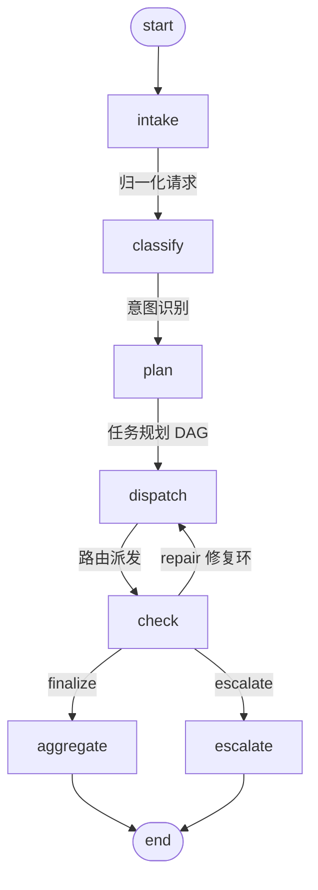

# supervisor-graph-mvp — Supervisor + 状态图，拆开看编排层

> **An orchestration layer in two pieces: a lightweight-model Supervisor (intent → DAG plan → routing →
> aggregation with a consistency check) running on an explicit state graph. Zero frameworks, zero runtime
> dependencies, and specialists that are deterministic — so the only non-deterministic surface in the whole
> system is three narrow model calls, each with a coded fallback.**
>
> 编排层的价值来自**结构**，不来自模型规模：把「谁该干活」交给轻量模型，把「谁说了算、什么时候回头」
> 交给一张显式状态图。


## Features

- **两件结构，各读一遍就能懂**：`supervisor.py`（轻量模型驱动的路由智能体）与 `graph.py`（状态图引擎），
  两者互不知道对方的实现细节——Supervisor 只认识 Agent 的名字与契约，图只认识节点与边。
- **Supervisor 职责严格限定四件事**：意图识别（闭集 + 关键词兜底）、任务规划（子任务 DAG + 校验/重问/模板兜底）、
  路由派发（按依赖顺序、修复轮只跑被点名的 Agent）、结果聚合（合并 + 一致性检查 + 引用兜底的结论叙述）。
- **专业 Agent 全是确定性函数**：分级（正则检测器 + 打码样本）、策略（规则表 + 谓词求值）、证据（sha256 复算）、
  处置（动作表）。同一输入永远同一输出，可复算、可审计、可离线测试。
- **状态图是显式的**：`intake → classify → plan → dispatch → check`，`check` 通过条件边决定
  **修复环回 `dispatch`**、**收口到 `aggregate`**、还是**升级 `escalate`**；节点/边/访问日志/预算都能打印与断言。
- **一致性检查是代码，不是"让模型自检"**：9 条固定规则（完整性、契约、级别可知、决策自洽、证据核验、
  引用可解析、处置自洽、跨 Agent 一致、叙述引用）把「规划缺陷」「证据不齐」「引用编造」变成可执行的修复目标。
- **修复环真的会改结果**：实测中，规划漏写依赖会被同轮续跑修好，规划**漏掉一整个专业 Agent** 会被合成出来并把它
  的下游一起重跑；修不好的（证据缺失）**升级人工**，而不是给一个假结论。
- **离线可跑、真机可验**：`--fake` 用脚本化模型重放五条轨迹（不需要 key、不发请求）；真机跑在 `deepseek-flash`
  上，五个场景共 14 次调用 / 11,380 tokens 全部落盘（`result.json` + `trace.jsonl` + `wire.jsonl`）。
- **可下钻的单文件报告**：`--html` 生成一份自包含 HTML，点节点看该节点的真实负载、点子任务看 Agent 原始产出、
  点问题看修复目标、点模型调用看提示词与响应原文——评审时不用信我的话，点开看。

## 背景

多智能体编排最容易走偏的地方是**把职责焊在一起**：路由的模型同时被指望"顺手给出结论"，一致性检查
被交回给同一个模型自检，出错就再问一遍"请重新输出"。结果是没法判断一次裁决到底是算出来的还是聊出来的。

这个 MVP 把编排层切成两件，各自只有一种职责：

1. **Supervisor**：只做四件事，且每件事都有一个**确定性兜底**（关键词分类、模板计划、模板叙述）。
   模型不可用时，流程照跑，裁决照出，失败原因留在 `llm_calls[*].error` 里。
2. **状态图**：把「检查结果→下一步」写成控制流而不是希望。`check` 是唯一允许把流程送回去的节点，
   而且只能在修复预算内；预算用尽仍有阻断问题，流程走 `escalate`，退出码 3。

领域知识放在两个地方，都不在模型里：**Agent 契约**（谁需要谁、产出什么字段）在代码里，
**策略与动作**在 `data/*.json` 里。所以"换个策略"是一次文件 diff，不是一次提示词玄学。

## 架构



| 节点 | 职责 | 说明 |
| ---- | ---- | ---- |
| `intake` | 请求归一化 | 补默认字段，后续节点看到同一套字段 |
| `classify` | Supervisor 职责一：意图识别 | 闭集 5 个意图；模型回复不可用时按关键词兜底 |
| `plan` | Supervisor 职责二：任务规划（子任务 DAG） | 校验四项（唯一 id / 已知 Agent / 依赖存在 / 无环）；先重问一次，再回退模板计划 |
| `dispatch` | Supervisor 职责三：路由派发 | 按 `depends_on` 排序、按 `requires` 补可见性、修复轮只跑被点名的 Agent（可合成缺失的） |
| `check` | 一致性检查 | 9 条规则 → 决定修复 / 收口 / 升级（唯一有权把流程送回上游的节点） |
| `aggregate` | Supervisor 职责四：结果聚合与叙述 | 合并四份确定性结论 + 生成引用可核验的结论说明 |
| `escalate` | 升级人工复核 | 证据无法自洽时收尾：写清原因、待办与对人工的要求 |

### 专业 Agent（确定性）

| Agent | 需要的 | 产出 | 实现要点 |
| ----- | ------ | ---- | -------- |
| `classification` | — | `level` P1–P4、`detectors[]`（命中数 + **打码样本**） | 正则检测器表；级别取命中里的最高级 |
| `policy` | `classification` | `decision`、`matched_rules[]`、`threshold_level` | 规则表 + 谓词求值；最严决策胜出；缺级别**不猜**，套"未定级"规则并自报 `incomplete` |
| `evidence` | — | `verified[]`、`unverified[]`、引用索引 | 规则引用查规则表，产物引用**重新计算 sha256** 比对 |
| `remediation` | `classification` + `policy` | `actions[]`（动作/责任方/时限） | 动作表按决策与级别选择：审计、审批、水印、阻断、通知、最小化 |

## 五个场景（覆盖编排的四条路径）

| 场景 | 请求 | 资产 | 期望路径 |
| ---- | ---- | ---- | -------- |
| `S1-public-allow` | 公开宣传稿投稿给合作媒体 | 无命中 | 直接收口：放行（3 次调用，6 步） |
| `S2-plan-gap` | 客户联系清单经企业邮箱发合作方 | 手机号 + 工号（P3） | 计划漏写依赖 → `check` 抓到 `C7` → **修复环**重跑处置 → 审批放行 |
| `S3-missing-evidence` | 同一清单，声称"审批单已走完" | 引用了一份不存在的审批单 | `C4` 阻断 → 修复重核仍失败 → **升级人工**（退出码 3） |
| `S4-block-p4` | 员工证件信息表发到外部邮箱 | 身份证 + 银行卡（P4） | 计划漏掉证据 Agent → `C5` → **合成**证据子任务 → 阻断 |
| `S5-plan-missing-agent` | 客户清单改走外部云盘 | 手机号 + 工号（P3） | 计划漏掉**级别判定** → 合成 `classification`，同一轮把依赖它的策略与处置一起重跑 |

## 快速开始

```bash
cd supervisor-graph-mvp
python3 -m venv .venv && .venv/bin/pip install -e ".[dev]"     # 运行时零依赖，dev 只为 pytest/ruff

# 1) 离线重放五条轨迹（不需要 key，不发网络请求）
.venv/bin/supervisor-graph run --all --fake

# 2) 只看"路由智能体"这一步的产物：意图 + 子任务 DAG + 校验结论
.venv/bin/supervisor-graph plan S2-plan-gap --fake

# 3) 状态图结构
.venv/bin/supervisor-graph graph --format mermaid

# 4) 真机（默认 deepseek-chat，可指定轻量模型）
export DEEPSEEK_API_KEY=sk-...
.venv/bin/supervisor-graph run S4-block-p4 --model deepseek-flash --trace-dir runs/live --html runs/live/report.html

# 5) 从既有运行目录重建可下钻报告
.venv/bin/supervisor-graph report runs/live/<run_id>
```

测试与静态检查：

```bash
.venv/bin/python -m pytest             # 224 项，全离线
.venv/bin/ruff check . && .venv/bin/ruff format --check .
```

## 命令与退出码

| 命令 | 用途 |
| ---- | ---- |
| `run [SCENARIO] [--all] [--fake] [--trace-dir DIR] [--html FILE] [--json]` | 端到端跑一条请求 |
| `plan [SCENARIO] [--fake]` | 只做意图识别与任务规划（不派发执行） |
| `graph [--format table｜mermaid]` | 打印状态图结构 |
| `report RUN_DIR [--out FILE]` | 从运行目录重建 HTML 报告 |
| `scenarios` / `probe` | 列出内置场景 / 连通性自检与 ping 用量 |

退出码：`0` 有裁决 · `1` 运行失败 · `2` 配置或输入错误 · `3` **升级人工**（非缺陷，是设计的结果之一）。

## 实测结果

### 真机（`deepseek-flash`，5 个场景，`runs/20260919_1047_live/`）

| 场景 | 裁决 | 级别 | 图步数 | 修复轮次 | 模型调用 | 总 tokens | 调用时延合计 |
| ---- | ---- | ---- | ------ | -------- | -------- | --------- | ------------ |
| S1-public-allow | allow | P1 | 6 | 0 | 3 | 1,743 | 4.4 s |
| S2-plan-gap | review | P3 | 6 | 0 | 3 | 1,944 | 4.7 s |
| S3-missing-evidence | **escalate** | P3 | 8 | 1 | 2 | 2,349 | 8.6 s |
| S4-block-p4 | **block** | P4 | 6 | 0 | 3 | 2,068 | 5.6 s |
| S5-plan-missing-agent | review | P3 | 6 | 0 | 3 | 3,276 | 11.4 s |
| **合计** | — | — | — | 1 | **14 次** | **11,380** | 34.8 s |

三点观察（都能在 `result.json` 里复核）：

1. **一次运行只有 2–3 次模型调用**：意图、计划、叙述各一次；升级路径跳过叙述，因此只有 2 次。
   领域结论一次都没让模型"顺手说说"。
2. **真实模型也会漏写依赖**：S4 的计划里四个子任务的 `depends_on` 全是空，但派发时按 Agent 声明的
   `requires` 补齐了可见性，四份产出依然完整（`results[*].output.status == ok`）——这是 §4.3 的
   "依赖可见性规则"在真机上的验证。
3. **模型自己踩到了证据坑**：S3 里模型把证据核验排在第一位，仍然被 `C4` 拦下并升级人工——
   说明检查的价值不在"模型会不会犯错"，而在"犯错时流程会不会装作没看见"。

### 离线（脚本化模型，`runs/20260919_1047_scripted/`，`--fake`）

| 场景 | 裁决 | 状态 | 图步数 | 修复轮次 | 触发的规则 | 修复方式 |
| ---- | ---- | ---- | ------ | -------- | ---------- | -------- |
| S1-public-allow | allow | ok | 6 | 0 | — | — |
| S2-plan-gap | review | needs_review | 8 | 1 | `C7-contract` | 重跑 `remediation`（attempt 2） |
| S3-missing-evidence | escalate | escalated | 8 | 1 | `C4-evidence` ×2 | 重核证据失败 → 升级（退出码 3） |
| S4-block-p4 | block | ok | 8 | 1 | `C5-citation` ×2 | **合成** `r1-evidence` 子任务 |
| S5-plan-missing-agent | review | needs_review | 8 | 1 | `C7-contract` ×2 | **合成** `classification`，并把 `policy`、`remediation` 一同重跑 |

`--fake` 的剧本是数据文件（`data/demo_script.json`），每个场景最多三条回复，与真机调用次数一致；
S2/S4/S5 的计划**故意有缺陷**，这样修复环与升级路径不需要"碰运气等模型犯错"就能被复现。

## 证据与产物

```
runs/<ts>_<场景>/
├── result.json    # 终态：intent · plan · results · findings · consistency · ruling · verdict · repair_log · llm_calls · graph · visits
├── trace.jsonl    # 事件流：node_exit · intent · plan · subtask · consistency · ruling · escalation · graph_stop
├── wire.jsonl     # 每次模型交换的原始请求/响应字节（含 usage 与 latency_ms）
└── report.html    # 由上面三件重建的可下钻报告
```

`diagrams/full-chain.html` 是 S4 脚本运行的可下钻报告（点节点看负载、点子任务看产出、点问题看修复目标、
点模型调用看提示词与响应）。`runs/` 不入库（含真实 API 响应），仓库内保留的是可复现命令与图表。

## 设计取舍

完整决策记录见 [`SPEC.md`](SPEC.md) §13，这里只列三条最关键的：

- **结论由确定性 Agent 产出，模型只做分类/规划/叙述**：代价是规则要自己维护，换来可复算、可审计、可离线测试。
- **状态图自研而非引 LangGraph**（约 460 行）：代价是没有并行、持久化与生态；换来零依赖与"每条边都能被断言"。
- **升级人工是一等公民**（独立节点 + 退出码 3）：宁可让人看到"没有结论"，也不让系统用兜底文本假装有结论。

## 想换成自己的专业 Agent？

1. 写一个 `Specialist` 子类：`name` / `mission` / `requires` / `required_output_keys` / `run(ctx)`，
   产出里带上 `citations`（可核验的引用 id）。
2. 在 `agents/registry.py` 的 `default_registry()` 注册它；`AGENT_REQUIRES`（模板计划用的依赖表）同步一行
   （测试会断言二者一致）。
3. 在 `consistency.py` 里补一条针对它的自洽规则（有正反例测试更好）。

Supervisor 的提示词目录、计划校验、派发、聚合都会自动跟上——你不需要改 Supervisor，也不需要改图。

## 目录结构

```
supervisor-graph-mvp/
├── src/supervisor_graph_mvp/
│   ├── graph.py          # 状态图引擎：节点/边/条件路由/环/预算/访问日志/DAG 校验（461 行）
│   ├── pipeline.py       # 图的装配：七个节点 + check 的条件边（271 行）
│   ├── supervisor.py     # 四职责 + 三段提示词 + 确定性兜底（738 行）
│   ├── consistency.py    # 9 条一致性规则与修复目标（437 行）
│   ├── state.py          # 状态键契约、reducer、纯视图helper（276 行）
│   ├── agents/           # 四个确定性专业 Agent + 契约 + 注册表
│   ├── llm.py            # DeepSeek 客户端（重试/退避/留痕）+ 脚本化客户端
│   ├── trace.py viz.py   # 证据落盘 + 单文件可下钻报告
│   └── data/             # 规则、检测器、动作表、场景、离线剧本、示例资产
├── tests/                # 224 项离线测试（含 project_rules 门禁套件）
├── diagrams/full-chain.html
├── SPEC.md · README.md
```

## 结论

- 「Supervisor + 状态图」拆开之后，两边的职责都能被单独测试：图的 29 项测试完全不涉及领域，
  Supervisor 的 23 项测试完全不涉及网络，一致性规则 27 项正反例各自独立可复现（另有 21 项项目门禁）。
- 三个窄职责调用（意图/计划/叙述）足以支撑一个四专业 Agent 的合规裁决；真机 5 场景 14 次调用、
  11,380 tokens，单场景 2–3 次调用。
- 把"检查"写成代码（9 条规则）之后，规划缺陷、证据缺失、引用编造这三类问题上都能给出**可执行的下一步**：
  要么指出谁该重做什么，要么明确升级人工——而不是"再问模型一次"。