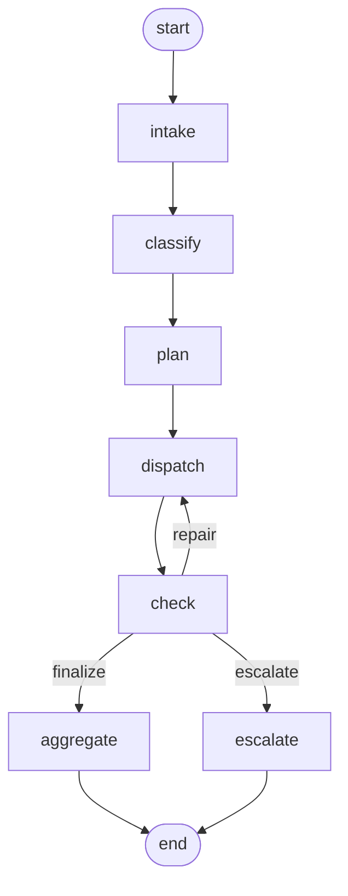

# supervisor-graph-mvp — SPEC（设计与契约）

> 本文是实现者视角的契约：状态图长什么样、子任务 DAG 怎么校验、一致性规则怎么判、
> 修复与升级何时触发、CLI 承诺什么、改动时必须同步什么。
> 背景、实测数据与结论在 [`README.md`](README.md)；本文件不重复叙事，只写可被实现和测试直接引用的规则。

| 项 | 值 |
| --- | --- |
| 版本 | 0.1.0 |
| 读者 | 实现者 / 复现者 / 想把「Supervisor + 状态图」搬到自己项目里的人 |
| 状态 | 已实现，224 个离线测试全绿 + 真实 DeepSeek 端到端验证通过（证据见 `runs/`，HTML 报告见 `diagrams/full-chain.html`） |

## 1. 目标与非目标

**目标**

1. 把编排层拆成两件**各自可单独读懂**的东西：Supervisor（轻量模型驱动的路由智能体）与状态图（执行骨架）。
2. Supervisor 的职责**严格限定为四件事**：意图识别、任务规划（DAG）、路由派发、结果聚合（含一致性检查）。
3. 专业 Agent 全部是确定性函数：同样的输入永远给同样的输出，可复算、可审计。
4. 图是显式的：节点、边、条件路由、修复环、预算、访问日志都能被打印和断言。
5. 全程可离线验证：测试与 `--fake` 演示不需要 API key、不发网络请求、不依赖时钟。

**非目标**

- 不做并行 fan-out、流式、多租户、持久化检查点（一个请求一次运行，状态留在内存里）。
- 不引入任何第三方运行时依赖（硬约束，见 §2）。
- 不追求"更聪明的模型"：本项目的论点是**编排价值来自结构，不来自模型规模**——Supervisor 默认跑在轻量模型上，且三个调用各有确定性兜底。
- 不做通用 agent 框架：只实现这一个域（终端数据外发合规审查）所需的编排。

## 2. 硬约束（由 `tests/test_project_rules.py` 强制）

| # | 约束 | 强制方式 |
| - | ---- | -------- |
| C1 | 运行时依赖为空 | 断言 `pyproject.toml` 含 `dependencies = []` 且 `requires-python = ">=3.9"` |
| C2 | 只用标准库 | AST 扫描 `src/**` 的 import 根模块，与 `sys.stdlib_module_names` 求差 |
| C3 | 不出现 agent 框架 / HTTP SDK | AST 扫描 import，黑名单（langchain · llamaindex · langgraph · autogen · crewai · dspy · smolagents · pydantic_ai · haystack · openai · anthropic · httpx · requests · aiohttp） |
| C4 | 核心逻辑模块不打印 | `graph.py` `consistency.py` `state.py` `supervisor.py` `pipeline.py` `predicates.py` 禁止 `print(` / `sys.stdout` |
| C5 | 每个模块自带说明 | 断言模块 docstring 长度 > 80 字符（含 tests） |
| C6 | 无企业数据资产 | 全仓扫描品牌字样 / 公司 bundle id / 签名标识 |
| C7 | 无证书 / 描述文件入库 | 按扩展名断言（忽略构建产物目录） |
| C8 | 无密钥形态字符串 | 扫描 `sk-…` 形态（源码、README、SPEC、演示脚本） |
| C9 | 模板计划的依赖与 Agent 契约一致 | 断言 `AGENT_REQUIRES` == registry 的 `requires`，且 `CANONICAL_PLAN` 的依赖闭包成立 |
| C10 | 数据文件与产物摘要自洽 | 断言 `detectors/policy_rules/remediation_actions/scenarios/demo_script` 可解析，且场景声明的 sha256 == 资产实算值 |

## 3. 组件与数据流

```
                      ┌──────────────────────── Supervisor（轻量模型驱动）────────────────────────┐
                      │ ① 意图识别 classify  ② 任务规划 plan  ③ 路由派发 route  ④ 结果聚合 aggregate │
                      └───────┬───────────────────┬───────────────────┬────────────────────┬─────┘
                              │ JSON              │ JSON (DAG)        │ 契约调用            │ JSON + 叙述
                              ▼                   ▼                   ▼                    ▲
                      ┌──────────────┐   ┌────────────────┐   ┌──────────────────────┐    │
   request ──────────►│ StateGraph   │──►│ validate_dag   │──►│ 专业 Agent（确定性）  │    │
   (scenario)         │ intake →     │   │ 环/未知/悬挂    │   │ classification ·     │    │
                      │ classify →   │   └────────────────┘   │ policy · evidence ·  │    │
                      │ plan →       │                        │ remediation          │    │
                      │ dispatch →   │                        └──────────┬───────────┘    │
                      │ check ───────┼───────────────┐                   │ 结论 + 引用        │
                      └──────┬───────┘               │                   ▼                   │
                             │  repair 环            │        ┌──────────────────────┐      │
                             └───────────────────────┘        │ ConsistencyChecker   │──────┘
                                      （预算 max_repairs）      │ C1…C9 → findings     │
                                                              └──────────────────────┘
```

依赖方向单向：`cli → pipeline → {supervisor, graph, consistency} → {agents, state, llm, predicates, jsonio} → config`。
专业 Agent 不认识图，图不认识领域，Supervisor 不认识"级别"和"规则"——它只认识 **Agent 的名字与契约**。

## 4. 数据契约

### 4.1 请求（`data/scenarios.json` 的一项）

| 字段 | 语义 |
| ---- | ---- |
| `id` / `title` / `text` | 场景标识、标题、请求正文（正文是意图识别与叙述的唯一自然语言输入） |
| `asset.path` | 相对 `data/assets/` 的资产文件名；`classification` 扫描它，`evidence` 复算它的 sha256 |
| `asset.channel` | 外发通道：`webmail` / `im` / `cloud-drive` / `publish` …（策略规则按它匹配） |
| `asset.destination_type` | `external` / `internal` |
| `asset.owner` | 数据属主（处置动作的责任方来源） |
| `evidence[]` | 请求方声称的证据：`{"id": "rule:R-03"｜"artifact:<file>", "kind": "rule"｜"artifact", "sha256": "…"}` |
| `notes` | 供人阅读的场景说明（会进入 HTML 报告，不进入模型提示词的硬性约束判断） |

### 4.2 内存状态（`state.py`）

一个 dict 贯穿整张图；键名集中在 `state.py`，reducer 策略只有三种：

| 键 | 含义 | reducer |
| --- | ---- | ------- |
| `request` / `options` | 本次输入（`intake` 归一化后不再变） | replace |
| `intent` | 意图识别结果 `{primary, intents[], composite, source, reason, llm}` | replace |
| `plan` | 计划 `{subtasks[], rationale, source, validation}`，`source ∈ {llm, llm_repaired, fallback}` | replace |
| `results` | 子任务结果，键为子任务 id（`/` 合并） | merge |
| `artifacts` | 证据索引（`evidence` 发布）：`artifact:…` / `rule:…` → `{kind, ref, sha256?, ok}` | merge |
| `findings` | 一致性检查的全部 finding | append |
| `consistency` | 最近一次检查的报告（`passed/blocking/warnings/decision/next_repairs`） | replace |
| `repairs` / `repair_log` | 已用修复轮次 / 每轮派发记录（含 `synthesized`） | replace / append |
| `ruling` / `narrative` / `verdict` / `status` | 聚合产物与终态 | replace |
| `llm_calls` | 每次模型调用的摘要（用途、字符数、时延、usage、是否解析成功、错误） | append |
| `visits` | 图访问日志（引擎写入） | append |
| `graph` | 收尾统计：`steps / stopped_reason / visits / node_visits`（引擎写入） | replace |

`status ∈ {ok, needs_review, escalated, failed}`；`verdict ∈ {allow, review, block, escalate}`。
**`escalate` 与 `review` 语义不同**：`review` 是策略给出的结论（需审批），`escalate` 是编排层承认自己的证据无法自洽、必须人工介入。

### 4.3 专业 Agent 契约（`agents/base.py`）

每个 Agent 实现 `run(ctx) -> dict`，`invoke()` 统一封装信封：

| 字段 | 语义 |
| ---- | ---- |
| `status` | `ok` / `incomplete`（缺输入或缺字段，附 `reason`） |
| `missing_inputs[]` | 缺哪些**其他 Agent 的产出**（如 `["policy"]`）——不是异常，是"我还不能给出结论" |
| `missing_fields[]` | 自身契约字段缺失（无法靠等别人补救） |
| `citations[]` | `{id: "rule:R-0x"｜"artifact:<file>", kind}`，聚合与一致性检查据此判定"可核验" |
| `agent` / `attempt` | 谁、第几次执行（修复后 attempt+1） |

四个 Agent 的产出字段与依赖：

| Agent | requires | 关键产出 | 失败时的行为 |
| ----- | -------- | -------- | ------------ |
| `classification` | — | `level`(P1-P4) · `detectors[]`(name/level/hits/samples，样本打码) · `asset` | 资产不可读 → `incomplete{missing_inputs:[asset]}` |
| `policy` | classification | `decision` · `matched_rules[]` · `threshold_level` · `level_used` | 缺级别 → 套用"未定级"规则并标 `incomplete`（**不猜**） |
| `evidence` | — | `verified[]` · `unverified[]` · `index{}`（引用索引） | 产物不存在/摘要不符/规则不存在 → 进 `unverified` 带原因 |
| `remediation` | classification, policy | `actions[]`(action_id/kind/owner/sla_hours) · `level_used` · `decision_used` | 缺输入 → `incomplete{missing_inputs}` |

**依赖可见性规则**：计划里的 `depends_on` 控制**顺序**，Agent 声明的 `requires` 控制**可见性**——派发时除了声明依赖的产出，还会补给该 Agent 所需的、当前已存在的其他产出。这条规则让"计划漏写依赖"不必动用修复预算（真实模型在 S4 就漏写了，见 README 实测）。

### 4.4 磁盘契约（`--trace-dir DIR` 产出三件）

| 文件 | 内容 | 关键字段 |
| ---- | ---- | -------- |
| `trace.jsonl` | 每次运行的事件流，**追加**写入 | 公共 `ts/run_id/event`；`node_exit`(node/step/duration_ms/updated_keys/next_node/error)；`intent`；`plan`；`subtask`；`consistency`；`ruling`；`escalation`；`graph_stop` |
| `wire.jsonl` | 每一次 HTTP 交换的原始字节（`--fake` 时为脚本记录） | `run_id/index/attempt/status/latency_ms/request{method,path,body}/response_raw/endpoint` |
| `result.json` | `reporting.result_payload()` 的缩进 JSON | `intent · plan · results · findings · consistency · ruling · verdict · status · repairs · repair_log · llm_calls · graph · visits` |

`trace.jsonl` / `wire.jsonl` 中不得出现完整密钥（测试断言 `sk-` 不出现）；HTML 报告由 `reporting/viz` 从这三件重新生成，含内嵌 HTML 转义（`<` `>` `&` → `\u003c` 等），不依赖任何 CDN。

## 5. 状态图契约（`graph.py` + `pipeline.py`）

### 5.1 节点与边

| 节点 | 职责（`NODE_HELP`） | 后继 |
| ---- | ------------------ | ---- |
| `intake` | 请求归一化 | `classify` |
| `classify` | Supervisor 职责一：意图识别 | `plan` |
| `plan` | Supervisor 职责二：任务规划（子任务 DAG） | `dispatch` |
| `dispatch` | Supervisor 职责三：路由派发（按依赖顺序执行） | `check` |
| `check` | 一致性检查（决定修复 / 收口 / 升级） | 条件边 |
| `aggregate` | Supervisor 职责四：结果聚合与叙述 | END |
| `escalate` | 升级人工复核（证据无法自洽） | END |

`check` 的条件边（router 读 `state["consistency"]["decision"]`）：

| 条件 | 目标 | 语义 |
| ---- | ---- | ---- |
| `repair` | `dispatch` | 有阻断问题且修复预算未用完且有明确修复目标 |
| `finalize` | `aggregate` | 无阻断问题 |
| `escalate` | `escalate` | 有阻断问题但预算已用完（或问题没有可执行的修复目标） |



### 5.2 引擎语义

| 能力 | 规则 |
| ---- | ---- |
| 节点 | `fn(state) -> dict | None`，返回值按 reducer 合并进状态；异常被记为一次失败访问（`error`），图**以 END 收口**而不是抛出 |
| 静态边 | 每个源节点只能有一个后继（写两条 → `GraphError`），防止"隐式 fan-out 藏起执行顺序" |
| 条件边 | `router(state) -> key | node_name | END`，mapping 与节点名都在 compile 期校验 |
| 环 | 合法（`check → dispatch` 就是环），由 `max_visits_per_node`（默认 8）与步数预算兜底 |
| 步数预算 | `max_steps`（默认 24，来自 `--max-supersteps`）；触顶写 `stopped_reason="step_budget"`，CLI 退出码 1 |
| 访问预算 | 单节点访问超限写 `stopped_reason="visit_budget:<node>"` |
| 可达性校验 | compile 期拒绝不可达节点；若存在"未声明 mapping 的条件边"则跳过该校验（无法证明不可达） |

### 5.3 子任务 DAG 校验（`validate_dag`）

Supervisor 产出的计划必须通过四项检查，否则进入修复/兜底：

| # | 检查 | 示例问题串 |
| - | ---- | ---------- |
| V1 | 每项是对象且有唯一 id | `duplicate sub-task id 't1'` |
| V2 | `agent` 必须来自注册表 | `sub-task 't1' names unknown agent 'wizard' (known: …)` |
| V3 | `depends_on` 必须指向本计划内已出现的 id，且不能自依赖 | `sub-task 't1' depends on missing 't9'` |
| V4 | 依赖图无环 | `dependency cycle: t1 → t2 → t1` |

### 5.4 派发顺序（`Supervisor.route`）

1. **就绪集**：`depends_on` 全部成功完成的待办子任务（按计划顺序）。
2. **可续跑集**：已执行但 `status=incomplete`、且其 `missing_inputs` 现在都有产出的子任务（`state.resumable_subtasks`）。`missing_fields` 型不完整不在此列——等不来救兵，重跑只会空转。
3. 修复轮：只派发 `check` 点名的 Agent；若计划里没有该 Agent 的子任务，**合成**一个（id `r<轮次>-<agent>`，`repair_log[].synthesized=true`）。
4. 单次 `route` 调用内每个子任务 id 最多执行一次（`max_dispatch` 默认 24 兜底），因此"两个互相等待的不完整产出"不会自旋——是否再给一轮由图决定。

## 6. Supervisor 契约（`supervisor.py`）

### 6.1 三次窄职责模型调用

| 用途 | 输入 | 期望输出（严格 JSON） | 失败时 |
| ---- | ---- | --------------------- | ------ |
| `classify` | 意图清单 + 请求摘要 | `{intents[], primary, reason}` | 关键词兜底（`source="fallback"`），`primary` 回落到 `compliance_ruling` |
| `plan` | Agent 目录（名字/职责/requires/产出字段）+ 意图 + 请求摘要 | `{subtasks[{id, agent, goal, depends_on[]}], rationale}` | 先带着校验错误重问一次（`llm_repaired`）；仍不合法则套用**代码内模板计划**（`fallback`） |
| `narrative` | 结论摘要 + 允许引用的 id 清单 | 3~5 句中文结论，引用形如 `[rule:R-03]` | 引用不可解析或调用失败 → 回退确定性模板（`narrative_source="deterministic_template"`） |

意图闭集（`INTENTS`）：

| 意图 | 语义 |
| ---- | ---- |
| `data_classification` | 资产敏感级别判定 |
| `policy_applicability` | 策略适用性判定 |
| `evidence_verification` | 证据核验 |
| `remediation_planning` | 处置建议 |
| `compliance_ruling` | 合规裁决（综合） |

模板计划（`template_plan`）：意图 → Agent 映射后再做 `requires` 传递闭包，因此"只要处置建议"也会自动带上 `policy` 与 `classification`。
`AGENT_REQUIRES`（`policy→[classification]`、`remediation→[classification, policy]`）必须与注册表契约一致（测试强制）。

### 6.2 路由的确定性

- 模型决定**拓扑**（哪些子任务、谁先谁后），代码决定**顺序、可见性、重试与预算**。
- 未注册的 Agent 名会在 `plan` 阶段被拒（V2），派发阶段再遇到只记为失败结果（`ok=false` + 原因），不抛异常。
- 路由不产生模型调用：一次运行只有 3 次调用（escalate 路径只 2 次）。

### 6.3 结果聚合

`aggregate()` 的确定性部分：`verdict = 有阻断问题 ? escalate : 策略决策`；`level`、`matched_rules`、`actions`、`evidence`、`findings`、`consistency` 全部按字段合并。
`narrate=False`（升级路径）时不调用模型，直接用模板叙述。

## 7. 一致性规则（`consistency.py`）

`ConsistencyChecker` 按固定顺序执行 9 条规则；`blocking` 会进入修复/升级判定，`warning` 只进报告。

| 规则 | 触发条件 | 级别 | 修复目标 |
| ---- | -------- | ---- | -------- |
| C1-completeness | 计划中的子任务没有结果，或结果 `ok=false` | blocking | 该子任务的 Agent |
| C7-contract | 产出 `status=incomplete` | blocking | 缺的输入若从未产出 → 那个 Agent；已产出 → 该 Agent 自己重跑 |
| C2-level-unknown | `policy`/`remediation` 的 `level_used` 为空，或整轮没有级别 | blocking | `classification` |
| C3-decision | `allow` 而级别高于放行阈值；`block` 却无命中规则；根本没有 `decision` | blocking | `policy` |
| C4-evidence | 任一证据未通过核验；或带了证据清单却一条都没通过 | blocking | `evidence` |
| C5-citation | 引用的 artifact 不在证据索引里（规则引用可从规则表解析，不算缺陷）；索引为空时归责核验方 | blocking | 引用方 / `evidence` |
| C6-remediation | 动作列表为空；缺 `audit`；`block` 无 `block` 动作；`review` 无 `approval`；级别 ≥P3 无 `minimize` | blocking | `remediation` |
| C8-agreement | `level_used` 与分级结论不一致；`decision_used` 与策略判定不一致；引用了未命中的规则 | blocking | 相关 Agent |
| C9-narrative | 叙述引用了不存在的 id | warning | —（已回退模板） |

判定只针对 `status=ok` 的产出：不完整产出由 C7 单独负责，避免"处置缺级别"这类把根因说错的告警。

## 8. 修复与升级契约

| 步骤 | 行为 |
| ---- | ---- |
| 收集 | `state.repair_targets(findings)` 把 blocking finding 按 Agent 归并，同 Agent 的多条 hint 合并（只增不减） |
| 预算 | `max_repairs`（默认 1，`--max-repairs`）；每次进入 `dispatch` 修复轮 `repairs+1` |
| 派发 | 只跑被点名的 Agent（缺失则该轮合成），并顺带续跑因此变得可续跑的子任务 |
| 复查 | 修复后重跑全部 9 条规则（`check` 节点再次访问） |
| 收口 | 无 blocking → `aggregate`；预算用尽仍有 blocking → `escalate`（`ruling.escalation` 写明原因、待办与对人工的要求） |

## 9. 领域数据契约（`data/*.json`）

| 文件 | 内容 | 关键约定 |
| ---- | ---- | -------- |
| `detectors.json` | `name/label/level/pattern/keep_prefix/keep_suffix` | 级别取全部命中里的最高级；样本只保留前后缀，中间打码 |
| `policy_rules.json` | `level_order` · `decision_precedence` · `rules[]`（`id/name/decision/threshold_level/owner/when[]`） | 决策取命中规则里最严的一条；阈值取最紧（级别序号最小）的一条 |
| `remediation_actions.json` | `actions[]`（`action_id/name/kind/owner/sla_hours/when[]`） | 动作按 `when` 全真选择；`kind` 是 C6 的判定口径 |
| `scenarios.json` | 五个示例请求（见 README） | 声明的 sha256 必须是资产真实摘要（测试强制） |
| `demo_script.json` | 每个场景的可离线重放回复（`classify`/`plan`/`narrative` 顺序） | 三段剧本必须覆盖全部场景；S2/S4/S5 的**计划故意有缺陷**，用来触发修复环 |

谓词语言（`predicates.py`）是数据文件的执行语义：`always` `level_unknown` `level_gte/lte/eq` `channel_in/not_in` `destination_type_eq` `decision_eq` `detector_hit`；
**未知算子抛错**（`AgentError`），不允许"写错了就当不命中"。

## 10. CLI 契约

| 命令 | 参数 | 行为 |
| ---- | ---- | ---- |
| `run [SCENARIO]` | `--all` | 端到端跑一条请求；`--all` 依次跑完全部内置场景 |
| | `--request FILE` | 用自定义请求（与 scenarios.json 单项同结构） |
| | `--fake` / `--script-file FILE` | 脚本化模型离线重放（不需要 key） |
| | `--model/--base-url/--api-key` | 覆盖环境变量（不提供默认密钥） |
| | `--max-supersteps N` / `--max-repairs N` | 步数预算 / 修复预算（默认 24 / 1） |
| | `--trace-dir DIR` / `--html FILE` | 落盘三件证据 / 额外生成单文件报告 |
| | `--dump-prompts` / `--json` / `--quiet` | 打印提示词 / 只输出结构化结果 / 静默过程日志 |
| `plan [SCENARIO]` | 同上（无 `--all`） | 只做意图识别与任务规划，打印计划表与校验结论 |
| `graph` | `--format table｜mermaid` | 打印状态图结构 |
| `report RUN_DIR` | `--out FILE` | 从既有运行目录重建 HTML 报告 |
| `scenarios` | — | 列出内置场景与可离线重放的剧本 |
| `probe` | — | 连通性自检：模型清单 + 一次 ping + 用量 |

**退出码**：`0` 产出裁决（含 `--fake`）；`1` 运行失败（模型不可用、图未正常收口、probe 的 ping 失败）；
`2` 配置/输入错误（缺 key、场景名不存在、`--fake` 未给场景、脚本文件非法）；`3` **升级人工**（`verdict=escalate`，非缺陷）。
`run --all` 依次跑完全部场景并返回各场景退出码的最大值（escalate 计为 `0`——批量运行的成功标准是"都跑完了"，
逐场景明细在 `--json` 的 `runs[]` 里）。

**stdout/stderr 分工**：裁决（或 `--json` 的结构体）走 stdout；过程 trace、`wrote <path>`、错误提示走 stderr；`NO_COLOR` 与非 TTY 都关闭颜色。

## 11. 网络与错误契约（`llm.py`）

| 情形 | 处理 |
| ---- | ---- |
| 408 / 409 / 425 / 429 / 5xx | 重试，最多 `max_retries`（默认 3） |
| 其它 4xx（401/403/400） | **不重试**，立即 `LLMError` |
| `URLError` / `socket.timeout` / `TimeoutError` / `ConnectionError` | 重试 |
| 响应体非 JSON、缺 `choices` | `LLMError`，并把原文前 300 字符留痕 |
| 退避 | `min(8s, 0.5 × 2^(n-1))` + 抖动 ≤ 0.25s；`sleep` 可注入（测试） |
| 超时 | 单次请求 `timeout_s` 默认 60s |
| 密钥 | 只从 `DEEPSEEK_API_KEY` 读；`repr=False`，`masked_key()` 只露尾 4 位 |

**模型不可用不等于流程不可用**：三个调用全部失败时，本次运行仍会给出裁决（意图/计划走兜底、叙述走模板），并把失败原因留在 `llm_calls[*].error`。

## 12. 可测性契约

- `ChatModel` Protocol（`complete(messages) -> Completion` + `exchanges`）是 Supervisor 唯一知道的模型接口。
- `ScriptedClient` 逐条重放脚本；脚本耗尽抛 `LLMError`（**绝不编造回复**），并暴露 `calls` / `prompts` / `exchanges` 供断言。
- 测试不得读环境变量里的真实密钥、不发真实 HTTP（`urlopen` 被 monkeypatch）、不依赖真实时钟。
- 报告与 CLI 的 JSON 字段稳定性由测试断言（`result.json` 的 16 个顶层键）。

测试矩阵（224 项）按模块：`graph` 29 · `consistency` 27 · `agents` 25 · `supervisor` 23 · `project_rules` 21 · `cli` 20 · `config_llm` 17 · `pipeline` 15 · `state` 14 · `predicates` 12 · `viz` 12 · `jsonio` 9（以 `pytest --collect-only` 为准）。

## 13. 决策记录（ADR）

| # | 决策 | 备选 | 取舍 |
| - | ---- | ---- | ---- |
| D1 | 领域结论全部由确定性 Agent 产出，模型只做分类/规划/叙述 | 让模型直接给裁决 | 代价是三个 Agent 的规则要自己维护；换来可复算、可审计、可离线测试 |
| D2 | 状态图自研（约 460 行）而非引 LangGraph | 引框架 | 代价是少了并行/持久化/生态；换来零依赖与"每条边都能被断言" |
| D3 | 子任务 DAG 在 `dispatch` 节点内部执行 | 图层面 fan-out | 图的形状保持"一条主干 + 一个环"，执行顺序由 Supervisor 掌握；代价是并发做不了 |
| D4 | 一致性检查用固定规则表而非让模型自检 | LLM-as-judge | 规则可解释、可回归；代价是规则要随领域演进（`SPEC` §7 是唯一改动点） |
| D5 | `requires` 决定可见性、`depends_on` 只决定顺序 | 严格按依赖图传参 | 让"漏写依赖"这类常见规划缺陷不用花修复预算；代价是 Agent 可能看到未声明的上游产出（有意如此） |
| D6 | 修复轮可以合成计划里没有的子任务 | 只能重跑已有子任务 | 让"漏规划一个专业 Agent"可被自动补上；代价是执行过的子任务集合可能大于计划（`repair_log` 记录在案） |
| D7 | 升级人工是一等公民（独立节点 + 退出码 3） | 用兜底文本收尾 | 宁可让人看到"没结论"，也不让系统假装有结论 |
| D8 | 叙述之后仍做引用兜底检查 | 相信模型不乱引 | 一次正则即可避免"编造证据"进入交付物；代价是极端情况下叙述被替换成模板 |
| D9 | 报告用内嵌 JSON 的单文件 HTML | 生成静态图 | 可点开看 payload（意图/计划/产出/问题/提示词），评审时能直接核对；代价是文件里带着整轮证据 |

## 14. 变更规程

| 改动 | 必须同步 |
| ---- | -------- |
| 加/改图节点或边 | `pipeline.NODE_HELP` + 本文 §5 + README 的节点清单（`test_project_rules` 会红灯） |
| 加/改一致性规则 | `consistency.py` 规则表 + `tests/test_consistency.py`（正/反例各一）+ 本文 §7 |
| 改 Agent 契约（`requires` / 产出字段） | 该 Agent + `AGENT_REQUIRES` + 提示词目录（自动生成，无需手改）+ README 的 Agent 表 |
| 加/改数据文件字段 | `predicates.py` 的算子 + 数据文件 + 本文 §9 + 相关单测 |
| 改 `result.json` / `trace.jsonl` 字段 | `reporting.result_payload` / `trace.Tracer` + `tests/test_cli.py::test_run_json_has_the_stable_top_level_contract` + 本文 §4.4 |
| 新增场景 | `scenarios.json`（真实 sha256）+ `demo_script.json` + README 场景表 + `diagrams/full-chain.html` 重新生成 |
| 任何新增 | 不得引入第三方运行时依赖（C1/C2 会红灯） |

## 15. 验收清单

| # | 验收项 | 证据 |
| - | ------ | ---- |
| A1 | 224 个测试全绿，全程离线 | `pytest` 输出 |
| A2 | lint 与格式零告警 | `ruff check .` / `ruff format --check .` |
| A3 | 无 key 可完整重放五条轨迹 | `supervisor-graph run --all --fake`（含修复环与升级路径） |
| A4 | 真机（轻量模型）五场景裁决正确 | `runs/20260919_1047_live/*/result.json` |
| A5 | 原始字节与用量可复核 | 各运行目录 `wire.jsonl`（含 usage、latency_ms） |
| A6 | 修复环、合成子任务、升级三条路径均有实测 | scripted 运行的 `repair_log` / `ruling.escalation` |
| A7 | 可下钻报告可离线打开 | `diagrams/full-chain.html`（点节点/子任务/问题/调用看原始 JSON） |
| A8 | 无框架依赖、无企业数据、无证书入库 | `tests/test_project_rules.py` |